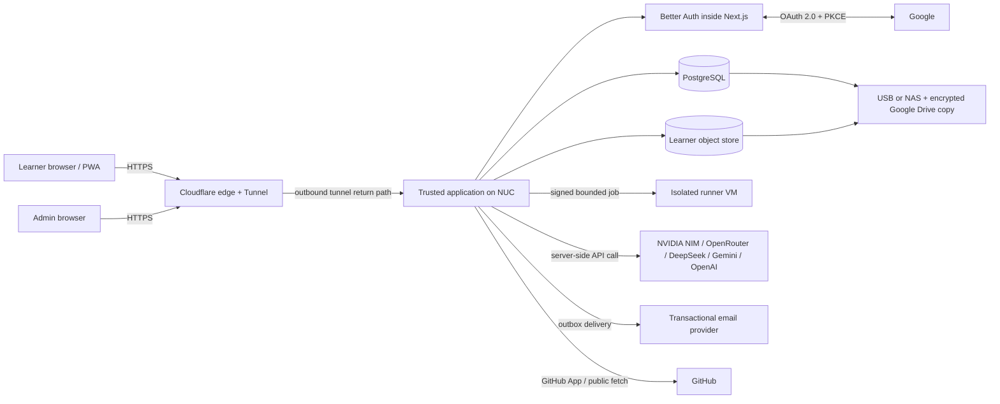

# Platform Architecture

**Status:** Authoritative baseline for PRD implementation\
**Last updated:** 2026-07-12\
**Decision record:** [ADR-0001](adr/0001-platform-architecture.md)

## 1. Purpose and scope

This document defines the implementation architecture for an invite-only, adaptive coding-learning platform piloting with two or three adult learners in India and the United States and scaling to approximately twenty. It covers the responsive web client, identity, curriculum and mastery services, AI-provider routing, code execution, GitHub review, storage, notifications, observability, deployment on the owner's Intel NUC, and recovery.

The architecture deliberately separates:

1. **trusted application work** such as identity, progress, content, and billing metadata;
2. **externally processed work** such as hosted LLM inference, Google OAuth, email, Cloudflare ingress, GitHub access, and Google Drive backup; and
3. **hostile work** such as learner programs and cloned repositories.

The requirements traced here use the IDs defined in [requirements-matrix.md](requirements-matrix.md). Security controls are expanded in [threat-model.md](threat-model.md), persisted entities in [data-model.md](data-model.md), and interaction behavior in [ux-flows.md](ux-flows.md).

## 2. Confirmed constraints and safe interpretations

| Constraint | Architectural interpretation |
|---|---|
| Two or three pilot learners, scaling to about twenty, approximately age 19 | Adult-only, invite/approval-gated cohort; no public registration. Age is represented as an 18+ confirmation, not a stored date of birth. |
| India and US access | Store timestamps in UTC; capture an IANA timezone per user; expose one HTTPS domain through Cloudflare Tunnel. |
| Intel NUC, 11th-generation i7, 32 GB RAM, 1 TB disk, Ubuntu 24.04 LTS | Sufficient for the trusted application and bounded concurrent compilation, but not for hosted local NIM inference. The installed point release must remain patched. |
| ACT 400 Mbps, CGNAT/no public IP | `cloudflared` creates outbound-only ingress. No application, database, SSH, hypervisor, or runner port is forwarded from the router. |
| Best-effort availability; no UPS initially | No availability SLA. BIOS power recovery, service restart, durable database settings, external monitoring, and offsite backups are mandatory compensating controls. A UPS remains strongly recommended. |
| Primary data local | PostgreSQL and durable learner objects remain on the NUC. Cloudflare, identity federation, email, AI providers, GitHub, and encrypted offsite backup are acknowledged subprocessors/remote services. “Local” does not mean traffic never leaves the premises. |
| Core Beta proposes C, C++, Java, Python, shared DSA, and the approved HTML/CSS/JavaScript/React web scope | One language-neutral concept graph with language-specific lesson variants, examples, exercises, runtime images, and assessment parity, plus a separate accessible web track. The final Core Beta breadth remains an explicit owner confirmation. Content publishes in versioned beta/verified stages. |
| External AI only; multiple per-user keys; NVIDIA NIM integration mandatory | A provider-neutral gateway includes an NVIDIA NIM adapter. Whether NIM must be the first provider or merely a supported provider remains a release-blocking policy decision. No local LLM is assumed. |
| Administrator requested controlled key reveal | Keys remain masked in every ordinary projection. A dedicated no-store reveal may return plaintext only after fresh MFA and a recorded reason; the attempt is immutably audited and the learner is notified every time. |
| One active device and 30-day “remember me” | One active database-backed Better Auth session/browser family per account; multiple tabs in the same browser profile are allowed. An active family blocks a new one. Normal logout or fresh-MFA/reasoned administrator revocation releases it; expired/revoked rows are archived without tokens and a newly admitted device sends a notice. |
| Long retention and complete learning context | Durable structured mastery and summaries, not unlimited prompt injection of raw history. Retention varies by data class and remains exportable/deletable where applicable. |
| Two to three GB desired per learner | Default durable quota is 2 GB, admin-adjustable to 3 GB. Browser storage is cache only and does not count as durable storage. |

## 3. Architecture principles

1. **Curriculum and deterministic evidence are authoritative.** The LLM may explain, personalize, classify, or critique, but cannot publish curriculum, see hidden tests, execute code, independently mark mastery, or close an appeal.
2. **A modular monolith is the unit of product development.** Domain modules have explicit interfaces and one transactional database; independently deployable microservices are deferred until measured load or isolation requires them.
3. **Hostile execution is a separate security plane.** Learner code and repository builds never run in the trusted Docker daemon or with access to trusted networks, secrets, or mounts.
4. **Server grading is canonical.** Browser games, visualizers, and optional quick-run runtimes improve responsiveness but never determine assessment results.
5. **Secrets are masked and purpose-bound after entry.** User provider keys use envelope encryption and are excluded from logs, analytics, RAG, exports and normal UI. The only plaintext return is the explicitly approved fresh-MFA/reason/audit/learner-notice administrator ceremony.
6. **Version everything that affects a decision.** Curriculum, prompts, rubrics, hidden tests, compiler images, model IDs, and mastery rules are recorded with attempts and appeals.
7. **Fail educationally, not catastrophically.** If AI is unavailable or over budget, authored lessons, deterministic quizzes, and server grading continue.
8. **Small scale does not reduce isolation requirements.** Ten trusted learners can still accidentally or deliberately execute destructive code.

### Enforced dependency direction

`npm run architecture:check` parses every TypeScript/TSX import and fails CI when deterministic domain code reaches database/AI/HTTP/UI layers, client modules import server runtimes, components reach database/credential boundaries, API handlers import UI implementation, or libraries import app/UI implementation. The machine report is [`architecture-import-boundaries-2026-07-12.json`](evidence/architecture-import-boundaries-2026-07-12.json).

Twenty-two exact legacy import pairs are documented in the checker, principally the browser-safe exam DTO/policy module and two admin DTO/formatter modules that predate this gate. The allowlist is file-and-import exact: a new dependency fails, and removing or moving a listed dependency creates a stale-exception failure so the debt cannot silently grow or linger. Extracting these pure shared contracts to `src/lib/exams` and `src/lib/admin` remains a maintainability cleanup, not an unenforced boundary.

## 4. System context



### Trust boundaries

- **TB-1 Browser/edge:** every browser value is untrusted, including code, Markdown, profile text, GitHub URLs, provider labels, and client-side scores.
- **TB-2 Cloudflare/origin:** only traffic arriving through the tunnel is accepted by the public origin listener. Forwarded IP headers are trusted only from the tunnel path.
- **TB-3 Authentication/application data:** Better Auth validates identity and sessions inside Next.js; application authorization remains a separate server-side check for every object.
- **TB-4 Application/provider:** prompts, code excerpts, and pseudonymous context leave the NUC only after policy checks and consent-aware routing.
- **TB-5 Application/runner:** jobs cross into a hostile execution environment through a narrow signed protocol. No secret crosses this boundary.
- **TB-6 Local/offsite backup:** backup archives are encrypted and authenticated before they leave the NUC.

## 5. Deployment topology

### 5.1 Trusted plane on the NUC

Trusted services run under Docker Compose or equivalent root-managed service definitions, with pinned image digests and distinct service accounts:

- `cloudflared`: the only public ingress path;
- `web`: Next.js/React responsive client, backend-for-frontend, and Better Auth server routes using the Drizzle adapter;
- `worker`: durable background jobs, email outbox, content verification orchestration, AI retries, retention jobs, and the separately permissioned deterministic regrade coordinator;
- `postgres`: application database containing the reviewed Better Auth/Drizzle schema and product schemas under separate database roles;
- `object-store`: private S3-compatible or filesystem-backed blob service for user-owned files;
- `reverse-proxy` if required for internal routing and uniform headers;
- telemetry collectors/exporters and a local operational dashboard.

No trusted service mounts the Docker socket. Database and object-store ports bind only to the trusted network. Administrative SSH and hypervisor access use a management VPN such as Tailscale or WireGuard, not the public application hostname.

### 5.2 Hostile execution plane

The runner runs in a dedicated KVM virtual machine with its own virtual network and firewall. Judge0 CE or a purpose-built runner may orchestrate disposable language containers inside that VM. Docker/Podman isolation inside the VM is defense in depth; the VM is the primary host boundary.

Runner network policy:

- deny runner-to-NUC host, trusted containers, database, object store, home LAN, router, metadata endpoints, and management network;
- deny internet egress while learner code executes;
- permit only the narrow application-to-runner job endpoint and runner-to-application result endpoint;
- for GitHub fetch, use a distinct controlled fetch stage that permits only GitHub endpoints, stores an immutable commit snapshot, then transfers it into a no-network analysis sandbox;
- no provider keys, tunnel credentials, backup credentials, or application environment are present in the runner.

Initial global execution concurrency is two jobs, with one active job per learner. The limit may rise only after CPU, memory, thermal, queue, and latency evidence. Recommended initial per-job ceilings are two CPU seconds, five wall-clock seconds, 128–256 MB memory, 32 processes/threads, 1 MB writable files, 64 KB combined output, and an input/source limit defined per exercise.

### 5.3 Resource budget

An initial 32 GB allocation target is:

| Workload | Target/limit |
|---|---:|
| Ubuntu host, filesystem cache, tunnel, telemetry | 4–6 GB |
| PostgreSQL + database-backed Better Auth workload | 4–6 GB |
| Web + worker + object metadata | 4–6 GB |
| Runner VM | 10–12 GB hard reservation/limit |
| Safety headroom | at least 4 GB |

The runner VM cannot dynamically consume all host memory. Thermal throttling, disk latency, and queue time are monitored before increasing concurrency.

## 6. Logical components

### 6.1 Web/BFF

Responsibilities:

- render accessible responsive pages for desktop, laptop, tablet, and iOS browsers;
- host Better Auth email/password, Google OAuth, MFA, verification, and database-backed session routes and set secure, HTTP-only cookies;
- validate requests and enforce learner/admin authorization;
- expose versioned JSON/SSE endpoints to the browser;
- stream AI responses after policy validation;
- never expose provider keys, hidden tests, reference solutions, or internal runner credentials;
- sanitize authored and AI Markdown and treat compiler output as text.

All trusted application persistence uses Drizzle ORM and committed Drizzle migrations against PostgreSQL. Reviewed raw SQL is limited to capabilities Drizzle cannot express adequately, such as RLS policies, constrained triggers, advisory-lock helpers, and specialized indexes; it remains migration-owned and tested.

The browser never connects directly to PostgreSQL, provider APIs, the runner, or object-store credentials. It uses only the deliberately exposed Better Auth and product routes in Next.js.

### 6.2 Identity and access

Better Auth with the Drizzle PostgreSQL adapter is selected to keep identity inside the lightweight Next.js deployment. Better Auth supplies database-backed users, accounts, sessions, verification records, email/password, Google social login, session listing/revocation, and plugins for two-factor authentication/passkeys. The application owns request approval, roles, the one-active-session invariant, mentor authorization, and security/audit projections. Better Auth's generated Drizzle schema is committed and reviewed; schema changes are applied through Drizzle migrations rather than runtime auto-migration.

Access lifecycle:

1. A visitor submits an access request with verified email and minimal rationale.
2. An admin approves or rejects it.
3. Approval creates a single-use, 24-hour enrollment link; no generated password is emailed.
4. The learner signs in through Google or creates a password in Better Auth, then registers and verifies TOTP plus recovery codes. A passkey may later be offered as a phishing-resistant first factor, but does not replace the required TOTP second-factor policy without a separately validated MFA design.
5. The Better Auth user ID becomes the owning application user ID (or is linked one-to-one to it), and the application initializes the learner profile.

Authentication configuration invariants:

- set a fixed production `baseURL`/Google callback on the Cloudflare hostname and an exact `trustedOrigins` allowlist; never disable Better Auth CSRF or origin checks;
- require email verification for credential accounts and enable session revocation on password reset;
- protect Better Auth's generic user-creation path with a before-hook that requires an approved, unconsumed enrollment grant. Opening the one-time link creates a short-lived HTTP-only enrollment context bound to the approved email; both password and first-time Google creation must present it. Existing users sign in normally;
- prevent implicit Google provisioning outside that grant, and link only a Google identity whose verified email matches the approved account under the explicit linking policy;
- enable the two-factor plugin with passwordless management only as needed for Google-only users, but require verified TOTP before any password or Google session can access product routes;
- set `trustDevice` false, keep sessions in PostgreSQL, and preserve a safe session-history projection when active rows are revoked;
- keep `BETTER_AUTH_SECRET` as versioned host secret material outside the database and backup, and test non-destructive rotation before production.

Sessions remain database-backed; stateless-only cookie sessions are not used because immediate revocation and one-device enforcement are requirements. A partial unique database guard admits exactly one active Better Auth session/browser family; concurrent new logins cannot race around the rule. Better Auth's two-factor plugin gates credential sign-in by default but not OAuth/social sign-in, so a mandatory reviewed hook must route Google completion through TOTP before the session is considered usable. An active family blocks a new one instead of silently replacing it. Normal logout, expiry, or fresh-MFA/reasoned administrator revocation archives token-free history and releases the slot. The database session itself may extend to 30 days under the remember policy; Better Auth's separate 30-day `trustDevice` bypass is disabled so logout/admin revocation cannot leave an MFA-bypass cookie behind. A short `freshAge` plus an application `last_mfa_at` check protects sensitive actions. Password/email changes, credential-vault changes, GitHub connections, account export/deletion, recovery, and privileged admin operations require recent MFA.

Admin “mentor view” is a read-only application view. Clicking a learner never implicitly impersonates them. Its normal dashboard uses aggregate/safe-field projections only. A separate POST-only mentor evidence reader can disclose exactly one selected learner category (chat, code submission, exam answer/result/integrity event, project PRD/review finding, or stored weekly AI summary) after fresh MFA, enumerated purpose, specific reason, rate limiting, bounded cursor/page and a fail-closed audit write. Queries join through the selected learner owner, response projections redact secret canaries and omit hidden assessment/runner/session/device fields. Sanitized records receive a strict 48 KiB item cap before the 128 KiB response-size paginator runs; explicit truncation metadata is shown, and every `hasMore` page is required to have a cursor so later records remain reachable. Responses are no-store and the UI clears them after five minutes. If real view-as is later authorized, it is an explicit, reason-required, MFA-confirmed, time-boxed break-glass flow with an inescapable banner and audit events; secret, identity, billing, deletion, and integration actions remain disabled.

### 6.3 Curriculum and publication

Curriculum is authored as version-controlled structured content and published into immutable course versions. The domain model is:

`catalog → track → track version → module → concept/lesson → activity → assessment/exercise`

Concepts form a directed acyclic prerequisite graph. Shared programming/DSA concepts link to language-specific content and exercise implementations. A publication cannot become “verified” until required source coverage, prerequisite validation, code compilation, hidden-test validation, cross-language parity, accessibility review, and admin approval evidence pass.

Generated content is never inserted directly into an active plan. A learner request is triaged as either a defect in promised coverage or a proposal for a new extension, then follows source review, implementation, automated verification, coverage audit, and versioned publication.

### 6.4 Learning and adaptive engine

The adaptive engine is deterministic and event-driven. It consumes assessment evidence and produces recommendations without rewriting the learner's historical evidence.

Core state:

- concept mastery score and status;
- evidence by type and language;
- known misconception tags;
- last practiced and next review time;
- active plan position and prerequisite eligibility;
- diagnostic confidence;
- learner-selected explanation style and analogy interests.

Default flow:

`diagnose → explain → worked example → micro-check → guided practice → code/debug task → mastery check → review`

Practice selection is enrollment- and publication-bound. Learner creation payloads use a strict allowlist and contain no grader, accepted answer, private feedback, hidden test, reference solution, or unrevealed help text. Progressive help is a transactional server command: a request-scoped advisory lock plus attempt row lock serializes requests; `practice_help_event` stores the idempotent step receipt; the attempt stores the monotonic maximum assistance level, reveal flag, and step. Only after both writes succeed is that one help payload returned. Submission ignores browser assistance/reveal claims and grades with the durable values, so a forged downgrade cannot turn assisted work into independent evidence. A receipt-insert failure rolls the attempt update back.

Self-reported level adjusts diagnostic length but does not prove mastery. A concept normally requires conceptual and applied evidence. Default exam semantics are: below 80 is not passed, 80–94 passes/unlocks but does not earn mastery, and 95+ plus all critical criteria earns mastery. These thresholds remain configurable, versioned policy rather than hard-coded constants.

### 6.5 Assessment and exam engine

The engine supports multiple choice, code tracing/output prediction, fill-in, debugging, coding, project rubric, and short explanation. Deterministic items are graded without AI. AI may provide rubric evidence for free text or code quality, but a deterministic or admin-reviewed decision is stored separately.

Exam sessions receive an immutable blueprint/form version, server time window, item versions, mastery policy, and runtime image digest. The server clock is authoritative. Autosave continues during reconnects and the last server-confirmed save submits at expiry. Focus loss, fullscreen exit, navigation, paste size, compile/run, reconnect, save, and submit may be logged after disclosure; these events are review signals, not automatic proof of cheating.

### 6.6 Code-run service

The application creates an immutable submission containing source files, language/runtime, exercise version, visible input, hidden-test bundle reference, and limits. It submits a signed job to the isolated runner and later validates the signed result.

The runner returns compile status, exit status, bounded stdout/stderr, time/memory, and per-test opaque results. Hidden test inputs, expected outputs, harness code, and reference solutions never return to the browser or LLM. Every authoritative outcome records the runner image digest and test-bundle version for reproducibility and appeals.

When human review confirms a faulty deterministic formal-exam test, the administrator creates a new reviewed bundle version against the exact original grading-evidence hash. The application snapshots all exact affected forms, answers, and results; queues at most two regrades per batch; reruns the complete form under the reviewed image digest; and appends a superseding result/mastery record. The old response, attempt, runner evidence, and badge-award row remain untouched. Exam history/readiness, administrator aggregates, and leaderboard scoring consume the explicit effective-result projection. Module badges and concept mastery move only through correction projections; concept mastery requires one exact course-version/module/concept/enrollment/language mapping and otherwise remains in a visible, retryable repair queue. AI may advise the human but has no write path to this workflow.

Browser quick-run is optional:

- games and data-structure visualizers run locally;
- Python visible-test preview may use Pyodide;
- C/C++ WASM preview is deferred unless download size and semantic differences are acceptable;
- Java remains server-run for runtime parity;
- all quick-run results are labelled “practice preview”; only “Submit/Grade” produces evidence.

### 6.7 AI gateway and learner memory

The AI gateway exposes product-level operations rather than provider APIs:

- `explainConcept`;
- `generateHint`;
- `classifyMisconception`;
- `critiqueCode`;
- `scoreRubricEvidence`;
- `generatePracticeVariant` under an approved specification;
- `summarizeThread`.

Provider adapters normalize NVIDIA NIM/OpenAI-compatible endpoints, OpenRouter, DeepSeek, Gemini, and OpenAI. Provider routing is constrained by the learner's configured credentials, provider consent, task capability, budget, and administrator policy. Request UUID receipts make client retries replay-safe; a request attempts each eligible learner key once in configured order before an optional admin fallback. The fallback credential may be used only when learner/provider consent and an active learner/model/time/token/rupee grant all allow it; usage is attributed through a durable dual-budget reservation ledger. Cross-request provider-health circuit breaking remains a production-hardening item.

Per-user BYOK credentials use envelope encryption. Each record stores ciphertext, nonce/tag, provider, key version, fingerprint/last four characters, status, and timestamps. A key-encryption key is held outside PostgreSQL and its backups in a root-owned host credential or TPM-backed mechanism. Decrypted values exist only in gateway memory for a provider call or the explicitly approved admin reveal ceremony. Ordinary APIs never return them; reveal requires fresh MFA, a reason, a no-store response, immutable audit, and immediate learner notification. Plaintext is never logged or exported.

“Complete learner context” is assembled from trusted structured state, relevant lesson blocks, misconception history, recent messages, and versioned summaries. Raw history is not blindly placed into prompts. Retrieval is metadata-first; vector retrieval is added only for an evaluated need. Learner code and messages are untrusted quoted data. Models receive no hidden tests and cannot invoke arbitrary tools.

### 6.8 Project and GitHub review

Projects are durable learner-owned workspaces subject to quota. Learners can append revision checkpoints under serialized optimistic concurrency and associate an existing owner-matching, undeleted, malware-scan-safe file. The association snapshots name/type/size/hash without copying bytes or adding quota; database update guards preserve the snapshot while permitting a deleted object's live reference to become null. Revision actions never invoke AI, the runner, GitHub, or review, preserving the product rule that the coach does not build a complete feature for the learner.

Public repository review requires URL validation and records the immutable commit SHA. Private repository support through a GitHub App with read-only, repository-scoped Contents/Metadata permissions remains planned rather than implemented; reusable personal access tokens are not accepted.

Static analysis is the default. Repository checkout happens in a controlled sandbox. Git hooks, GitHub Actions, arbitrary install scripts, and build commands do not execute automatically. If build/test review is later allowed, it uses approved language templates, pinned toolchains, no-network execution, and an allowlisted dependency cache/proxy. Review artifacts record commit SHA, analyzer versions, model/prompt versions if AI is used, findings, and appeal state.

### 6.9 Social and gamification

Cohort profiles expose only learner-selected fields. Alias/display name is the default. Email, exact activity times, raw attempts, failures, code, keys, GitHub credentials, and provider usage are never cohort-visible. Badges, streaks, mastery, and projects derive from authoritative events; leaderboards avoid rewarding raw time, excessive submissions, or completion speed. Visibility and leaderboard participation are independently revocable.

### 6.10 Notifications

Notifications are written transactionally to an outbox and delivered asynchronously. An inactivity episode is based on the last meaningful learning event, not merely login. At 24 hours the learner and administrator each receive a separate generic notice; at 72 hours the learner receives one final generic reminder, after which the episode is silent until meaningful activity closes it. An advisory-locked scheduler commits episode markers and deterministic-idempotency outbox rows together. Learner-local IANA timezone/quiet hours, a fresh-MFA/reason/audit-protected temporary administrative pause, and the disclosure/policy version are stored explicitly. Emails contain no sensitive mistakes, scores, code, chat, provider details, keys, or raw study time.

Security events, new-device revocation, credential changes, appeal updates, and backup failures use separate templates and priorities. Backups are never attached to email; email reports only backup identifier, status, size, checksum, and recovery-point count.

### 6.11 Storage and quota

PostgreSQL holds relational state, version metadata, events, summaries, and object manifests. Large learner files reside in private object storage addressed by opaque IDs; filesystem paths are never user-controlled.

The default 2 GB durable quota counts uploads, saved repository snapshots, and generated downloadable artifacts. It excludes shared curriculum, transient compilation files, build caches, and ordinary relational text. Per-file size defaults to 25 MB and may rise to 50 MB for approved types. Executables and unsafe archives are rejected. Temporary checkouts and build artifacts expire automatically.

The browser keeps only an HMAC user-and-session-namespaced `sessionStorage` working copy for a warm open page; there is no service worker, IndexedDB/OPFS authority, cold-offline launch, or install surface. PostgreSQL is authoritative and mutations use durable request receipts plus optimistic row versions. Code-draft identity includes implementation language, so DSA language switches cannot overwrite another facet. A 401/403 purges the complete current-session namespace, while failed sign-out preserves dirty local-only text; confirmed sign-out clears synchronously before navigation. Server saves require an active/completed enrollment in a beta/verified course skill and serialize a 512-record/32 MiB per-user aggregate quota that is mirrored by a PostgreSQL trigger.

## 7. Primary runtime flows

### 7.1 Lesson and adaptive progression

```mermaid
sequenceDiagram
    participant B as Browser
    participant A as App
    participant D as PostgreSQL
    participant G as AI Gateway
    participant R as Runner VM

    B->>A: Resume learning session
    A->>D: Load plan, mastery, due reviews, content version
    A-->>B: Next lesson and reason
    B->>A: Request alternative explanation
    A->>G: Trusted lesson + bounded learner context
    G-->>A: Schema-validated explanation
    A-->>B: Stream sanitized response
    B->>A: Submit quiz/code evidence
    opt coding evidence
        A->>R: Signed immutable job
        R-->>A: Signed bounded result
    end
    A->>D: Append attempt and evidence; update mastery transactionally
    A-->>B: Feedback, mastery change, and next action
```

### 7.2 BYOK fallback

1. Resolve task capability and approved provider order.
2. Filter to learner credentials that are active, consented, under budget, and healthy.
3. Prefer configured NIM behavior once the mandatory-NIM policy is resolved.
4. Decrypt one credential in memory, make one bounded request, and discard plaintext.
5. Do not blindly retry an ambiguous provider call. Durable request UUIDs replay the completed safe result without another provider call; within a fresh execution, move once through the remaining enabled learner keys.
6. Only after every approved learner credential fails, consider the explicitly consented administrator fallback and atomically reserve its model-bound token and rupee caps before transmission.
7. If none succeed, serve authored content and record a provider-unavailable event; never block deterministic grading.

### 7.3 Backup and restore

Nightly jobs create a consistent PostgreSQL dump and object manifest, then write an encrypted, deduplicated backup to a 1–2 TB USB/NAS target. Retention is seven daily, four weekly, and twelve monthly restore points. A weekly job copies the already encrypted repository to a dedicated Google Drive account using resumable transfer. The free 15 GB Google quota is insufficient because it is shared with Gmail and Photos; a paid capacity appropriate to measured data is required ([Google storage documentation](https://support.google.com/drive/answer/9312312?hl=en)).

Backup encryption/recovery keys are stored separately from the NUC, local target, and Google account. Upload checksums and repository integrity are verified. A quarterly restore drill rebuilds a clean environment and verifies database, object, identity, content, and appeal evidence. Initial objectives are 24-hour RPO and best-effort 8–24-hour RTO.

## 8. Interfaces and consistency rules

### Browser API

- JSON over HTTPS for commands/queries; SSE for tutor streaming and job status where useful.
- Mutating requests require CSRF defense, an idempotency key where retries are plausible, and optimistic version/ETag for concurrent plan/draft edits.
- Errors use stable codes, correlation IDs, safe user copy, and no stack traces.
- Pagination is mandatory for messages, attempts, events, projects, and audit history.

### Application-to-runner protocol

- Mutual authentication or signed short-lived job tokens.
- Strict request schema and supported runtime allowlist.
- Job IDs are unguessable; results bind job ID, submission hash, test version, and image digest.
- At-most-one authoritative result is accepted per job; retries create explicit attempts.

### Provider interface

- Per-operation typed input/output schema.
- Explicit timeout, maximum tokens, provider/model allowlist, and cost estimate.
- Content and learner-context version identifiers accompany every call.
- Provider response IDs, token use, latency, fallback reason, and validation outcome are stored; secrets and unnecessary raw provider payloads are not.

## 9. Security architecture

Baseline controls include:

- TLS at the edge and tunnel; HSTS, restrictive CSP, frame protection, MIME sniff prevention, and secure cookies;
- Better Auth database-backed cookie sessions, Google OAuth state/PKCE, required MFA/recovery codes, one-active-session enforcement, and recent-MFA checks;
- object-level authorization and PostgreSQL row-level security/defense-in-depth policies;
- Better Auth's reviewed password hashing configuration (scrypt by default), versioned `BETTER_AUTH_SECRET` rotation, and no application/admin password visibility;
- application envelope encryption for BYOK, full-disk encryption where unattended boot requirements permit, and distinct backup encryption;
- input validation, output encoding, sanitized Markdown, and no raw HTML from learners/models;
- strict SSRF allowlists for provider, GitHub, and email adapters;
- immutable audit events for admin actions, key lifecycle, identity recovery, plan edits, appeals, content publication, and view-as;
- dependency lockfiles, pinned images, SBOM/dependency scanning, secret scanning, and controlled updates;
- no session replay or raw keystroke/clipboard collection;
- rate limits by edge, account, user, operation, and global runner/provider budget;
- tested deletion/export behavior and retention jobs.

The detailed attack analysis and verification cases are in [threat-model.md](threat-model.md).

## 10. Observability and operations

Every request receives a correlation ID propagated to job, provider, email, and audit metadata. Structured logs redact authorization, cookies, provider keys, password/MFA values, raw recovery codes, hidden tests, and unnecessary prompt/code bodies.

Required dashboards/alerts:

- public health and external reachability;
- CPU, memory, temperature, disk latency, free space, SMART/NVMe health;
- PostgreSQL connections, lock wait, backup age, restore-point count;
- runner queue depth, timeouts, OOM/process kills, compiler image version;
- provider success, schema failures, latency, tokens, cost, circuit state;
- auth failures, MFA recovery, session replacement, rate-limit activation;
- email outbox age, bounce/suppression rate;
- per-user and total object quota;
- curriculum verification failures and appeals awaiting review.

Service startup uses health checks and dependency ordering; schema migrations take an advisory lock and run once. Docker logs rotate. BIOS restores power after AC loss. `cloudflared`, database, app, worker, and telemetry run under restart-capable systemd/Compose policies. These do not replace a UPS or backups.

## 11. Performance and resilience targets

Initial service objectives, not contractual SLAs:

| Measure | Target |
|---|---:|
| Cached/static page response at origin | p95 < 300 ms |
| Normal authenticated API excluding external work | p95 < 750 ms |
| Quiz submission | p95 < 1 s |
| Runner queue acknowledgement | < 500 ms |
| Typical single-file code result | p95 < 8 s under supported concurrency |
| First streamed tutor token | p95 < 5 s when provider healthy |
| Autosave interval | no more than 10 s of unsynced active work |
| Concurrent active learners | 10 |
| Global authoritative runner jobs | 2 initially |
| RPO / RTO | 24 h / best-effort 8–24 h |

Provider, GitHub, email, or AI failure must not corrupt the learning transaction. Durable jobs use exponential backoff with caps and dead-letter/admin review. The application presents maintenance/read-only states when storage is near capacity or migrations/backups fail.

## 12. Requirement-to-component traceability

| Requirement domains | Primary components | Acceptance evidence |
|---|---|---|
| AUTH-*, SES-* | Better Auth/Drizzle inside Next.js, session policy, audit | Google/password/MFA/session E2E tests; revocation and recovery drill |
| CUR-*, LES-* | curriculum module, publication worker, object store | coverage report; code/example verification; publish audit |
| ADP-*, ASM-*, EXM-* | adaptive, assessment, exam modules | golden progression scenarios; immutable policy/form evidence |
| RUN-* | submission service, runner VM | adversarial sandbox suite; language parity tests; reproducibility test |
| AI-* | gateway, credential vault, learner-memory assembler | provider contract tests; no-secret logs; fallback/eval suite |
| PRJ-* | project store, GitHub App, repository sandbox | permission audit; malicious-repository test; SHA reproducibility |
| SOC-* | profile/achievement/read model | visibility matrix and opt-out E2E tests |
| ADM-* | admin console, audit module | authorization tests; plan-edit diff; mentor-view test |
| NOT-* | outbox, scheduler, email adapter | timezone/episode/idempotency/bounce tests |
| DAT-* | PostgreSQL, object store, retention/export/backup jobs | quota tests; deletion/export report; quarterly restore report |
| NFR-SEC/PRV-* | all boundaries | threat-model control verification; privacy review |
| NFR-PERF/REL/OPS-* | deployment and telemetry | load test, chaos/provider outage test, monitoring evidence |
| NFR-A11Y-* | web client/content pipeline | automated and manual WCAG-focused review |

## 13. Release-blocking decisions

The following must be resolved before production pilot, even though the architecture has extension points for them:

1. Does “NIM mandatory” mean first-choice routing, mandatory adapter availability, or no AI response without NIM, and which production-authorized NIM endpoint/license is used?
2. Which transactional email provider and sending domain are approved?
3. Is optional passkey first-factor support needed in Core Beta, and what proof is required for manual recovery? TOTP remains the baseline required second factor for password and Google flows.
4. What paid Google Drive/Google One capacity is approved for the weekly encrypted copy, and who holds account recovery?
5. Are private GitHub repositories in the first release, or only public repository static review?
6. Which exact CPython, GCC/G++, language-standard, and OpenJDK versions define authoritative execution?
7. Is browser Python quick-run in the first release or deferred so all runs are initially identical?

## 14. Authoritative implementation references

- Cloudflare documents Tunnel as an outbound-only connection suitable when the origin has no publicly routable IP: [Cloudflare Tunnel](https://developers.cloudflare.com/cloudflare-one/networks/connectors/cloudflare-tunnel/).
- Better Auth documents its Drizzle adapter, generated schema, database-backed sessions/revocation/freshness, Google/email-password flows, and two-factor/passkey plugins: [Drizzle adapter](https://better-auth.com/docs/adapters/drizzle), [session management](https://better-auth.com/docs/concepts/session-management), [security](https://better-auth.com/docs/reference/security), and [plugin catalog](https://better-auth.com/docs/plugins).
- NVIDIA documents its OpenAI-compatible NIM LLM API: [NIM API reference](https://docs.nvidia.com/nim/large-language-models/latest/api-reference.html), and distinguishes prototyping from production licensing: [Run NIM Anywhere](https://docs.api.nvidia.com/nim/re/docs/run-anywhere).
- Judge0 documents sandboxed language execution and resource limits: [Judge0 CE API](https://ce.judge0.com/) and [Judge0 repository](https://github.com/judge0/judge0).
- Docker documents defense-in-depth controls but these do not remove the separate-VM requirement: [rootless mode](https://docs.docker.com/engine/security/rootless/) and [seccomp](https://docs.docker.com/engine/security/seccomp/).
- PostgreSQL documents logical backup and restore with `pg_dump`/`pg_restore`: [Backup and Restore](https://www.postgresql.org/docs/current/backup.html).
- Google documents that consumer storage is shared across Drive, Gmail, and Photos: [How Google storage works](https://support.google.com/drive/answer/9312312?hl=en).
