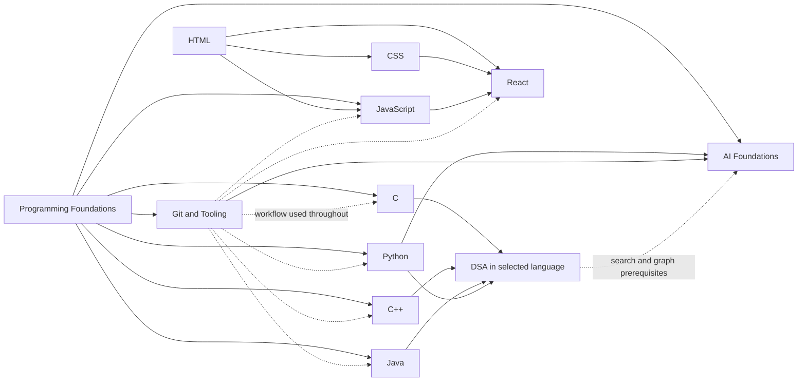

# Launch 1 curriculum coverage

Last audited: 2026-07-12

The authoritative machine-readable artifacts are [the catalog](../../content/catalog.json), [the course schema](../../content/schema/course.schema.json), the Launch 1 manifests in `content/courses/`, and the separate [roadmap schema](../../content/schema/roadmap-track.schema.json) and metadata-only manifests in `content/roadmap/`. This document explains what their coverage claims mean and records the Launch 1 baseline without counting future scope as delivered content.

## Coverage baseline

| Track | Status | Version | Modules | Atomic skills | Required | Covered | Runtime baseline |
|---|---:|---:|---:|---:|---:|---:|---|
| Programming Foundations | Beta | 0.1.0 | 8 | 32 | 32 | 32 | Language-neutral pseudocode |
| C | Beta | 0.1.0 | 9 | 36 | 36 | 36 | C23 portable subset |
| C++ | Beta | 0.1.0 | 10 | 40 | 40 | 40 | C++20 with labeled C++23 additions |
| Java | Beta | 0.1.0 | 10 | 40 | 40 | 40 | Java SE 21 LTS |
| Python | Beta | 0.1.0 | 10 | 40 | 40 | 40 | Python 3.14 |
| HTML | Beta | 0.1.0 | 8 | 32 | 32 | 32 | WHATWG HTML Living Standard |
| CSS | Beta | 0.1.0 | 8 | 32 | 32 | 32 | CSS Snapshot 2024 modules |
| JavaScript | Beta | 0.1.0 | 10 | 40 | 40 | 40 | Current ECMAScript in the target browser matrix |
| React | Beta | 0.1.0 | 10 | 40 | 40 | 40 | React 19.2 client APIs |
| Data Structures and Algorithms | Beta | 0.1.0 | 15 | 60 | 60 | 60 | C23, C++20, Java 21 LTS or Python 3.14 |
| Git and Developer Tooling | Beta | 0.1.0 | 9 | 36 | 36 | 36 | Current stable Git and supported shells |
| Artificial Intelligence Foundations | Beta | 0.1.0 | 12 | 48 | 48 | 48 | Python 3.14 and pinned teaching libraries |
| **Total** |  |  | **119** | **476** | **476** | **476** |  |

All Launch 1 skills are required. Advanced language features and ecosystem frameworks are separate Launch 2 or Launch 3 tracks, not hidden elective requirements inside these manifests.

`coverage_status: covered` means the skill is fully represented in the declared beta scope with outcomes, prerequisites, evidence types and sources. It does not by itself claim that every lesson, assessment variant or application screen has passed verified-release QA. That stronger claim is represented by course status `verified`.

## Post-Launch roadmap (not authored or published)

These admin-approved roadmap records make future scope visible without presenting an empty course as learnable. Every corresponding manifest is `coming-soon`, declares `learner_content_available: false`, and fixes authored lessons, assessment banks and exam-eligible items at zero. They are excluded from the 12-course, 476-skill Launch 1 totals.

| Roadmap track | Target release | Required published track(s) | Learner state |
|---|---|---|---|
| Advanced C | Launch 2 | C | Coming Soon; locked |
| Advanced C++ | Launch 2 | C++ | Coming Soon; locked |
| Advanced Java | Launch 2 | Java | Coming Soon; locked |
| Advanced Python | Launch 2 | Python | Coming Soon; locked |
| Advanced React | Launch 2 | React | Coming Soon; locked |
| Qt | Launch 3 | C++ | Coming Soon; locked |
| NumPy | Launch 3 | Python | Coming Soon; locked |
| pandas | Launch 3 | Python and NumPy | Coming Soon; locked |
| Spring Framework | Launch 3 | Java | Coming Soon; locked |
| Spring Boot | Launch 3 | Java and Spring Framework | Coming Soon; locked |

The learner roadmap may show each title, release, prerequisite labels and scope brief, but it emits no course link. Completing prerequisites does not unlock a Coming Soon record. An audited administrator override may bypass prerequisites only after a track has separately passed publication and changed to a teachable status; it cannot turn roadmap metadata into lessons.

## Declared Launch 1 catalog

### Common and language foundations

- Programming Foundations supplies the absolute-beginner mental models that official language tutorials commonly assume.
- C covers the portable C23 core used by mainstream toolchains through pointers, dynamic memory, files, modules and undefined-behavior diagnostics.
- C++ teaches modern C++ directly through value semantics, RAII, standard containers and algorithms, classes, polymorphism and modest generic programming.
- Java covers Java SE 21 LTS through packaged applications, object modeling, generics, collections, streams, files, JUnit, Maven and concurrency basics; preview features are excluded.
- Python covers Python 3.14 through multi-module packaged applications, built-in data structures, object protocols, iteration, typing, tests and concurrency selection basics.

### Web path

- HTML establishes semantic, accessible content before styling or scripting.
- CSS covers the cascade, intrinsic and responsive layout, reusable styling systems, visual accessibility and compatibility.
- JavaScript covers the ECMAScript language, browser DOM and events, modules, asynchronous work, HTTP, client security and tests.
- React requires the three web foundations and ends with an accessible, routed, fetch-backed, tested single-page application. Next.js, Server Components and external state libraries are not Launch 1 requirements.

### Web executable-evidence boundary

The draft web tranche classifies all 144 HTML, CSS, JavaScript, and React skills exactly once. It currently contains 104 authoring-only browser-verifier items, 21 digest-pinned Node items, and 19 explicitly justified non-code facets. Every code item has at least one visible and one hidden critical check. The full offline verifier executed all 256 cases successfully: 208 in Playwright 1.61.1 / Chromium revision 1228 (reported Chromium 149.0.7827.55) and 48 through the isolated Node 22.23.1 image. The exact report is [`web-executable-runtime-2026-07-12.json`](../evidence/web-executable-runtime-2026-07-12.json).

`browser-verifier` is deliberately an authoring-evidence engine, not the production untrusted-code runner. Its network is denied except for exact in-memory response fixtures, service workers are blocked, React fixtures are bundled with the lockfile-resolved esbuild 0.25.12, and selected semantic/accessibility cases run axe serious/critical rules. The official exam blueprint fails closed if a browser-verifier item is ever made exam-eligible. Browser items require a separately isolated production artifact runner and human approval before they can enter learner grading or formal exams.

React Router 8.0.1 is now an exact runtime dependency. A path-safe virtual project contract materializes a minimal eight-file portfolio SPA only in a temporary directory, bundles explicit application and test entrypoints, exercises nested routes, direct entry, parameters, not-found state, Link navigation, route title/focus, a controlled form, async success/error/empty states, and nine Testing Library/user-event checks, then deletes the files. This is bounded reference evidence—not a learner project sandbox or portfolio approval.

The 19 non-code classifications are not missing classifications disguised as passes. They identify evidence a small deterministic artifact still cannot honestly establish: manual accessibility and assistive-technology audits, DevTools/profiler process, architecture and component-API review, the Vite dev/build/preview lifecycle, and complete human capstone evaluation. All 144 banks remain AI-assisted drafts with null reviewers and formal-exam eligibility disabled.

### Language and AI executable-evidence boundary

The C and C++ tranche classifies all 76 declared skills: 66 have isolated executable tasks and 10 have explicit non-code evidence requirements. Its repaired verifier separates structure, sample and full artifacts so lightweight checks cannot overwrite runtime proof. The fresh full pinned-image run passed all 199 visible and hidden cases under Alpine GCC 14.2 and G++ 14.2; [`c-cpp-executable-runtime-2026-07-12.json`](../evidence/c-cpp-executable-runtime-2026-07-12.json) records `status: verified`, `fullRuntimeRun: true`, exact image/compiler matches, 199 passed and zero failed.

The Programming Foundations, Java and Python tranche contains 45 deterministic code tasks selected where a bounded standard-library program is valid evidence: one Foundations task, 24 Java tasks and 20 Python tasks. Its full pinned-image run passed all 91 visible and hidden cases under OpenJDK 21.0.11 and Python 3.14.6. The exact report is [`java-python-executable-runtime-2026-07-12.json`](../evidence/java-python-executable-runtime-2026-07-12.json).

The AI course contains 24 deterministic offline Python labs. Its full pinned-image run passed all 48 visible and hidden cases under Python 3.14.6 without external provider calls. The exact report is [`ai-code-executable-runtime-2026-07-12.json`](../evidence/ai-code-executable-runtime-2026-07-12.json). These labs verify bounded mechanics and safety contracts; they are not evidence that live provider behavior, model quality, current provider terms or learner-facing pedagogy has been approved.

The C/C++, Java/Python and AI reports confirm the exact local immutable image IDs before executing with networking disabled, a read-only source mount and root filesystem, dropped capabilities, no-new-privileges and bounded CPU, memory, process and file limits. These local artifacts do not replace human source, pedagogy, accessibility, assessment-oracle or production KVM review, and every associated bank remains exam-ineligible.

### Cross-cutting tracks

- DSA stores concept mastery independently from implementation mastery and provides equivalent implementation evidence in C, C++, Java and Python.
- Git and Developer Tooling covers terminal, source control, collaboration, builds, quality automation, CI, secrets and recovery.
- AI Foundations covers symbolic and learned AI, search, reasoning, planning, machine learning, neural networks, applications, generative AI and lifecycle risk management.

## Prerequisite graph



The graph shows recommended course-level routing. The manifests contain the authoritative atomic-skill prerequisites used for diagnosis and remediation.

## DSA parity and language switching

The DSA curriculum has two evidence layers:

1. **Concept evidence** covers representation, invariants, correctness, complexity, selection and transfer.
2. **Implementation evidence** covers syntax, language libraries, ownership or reference behavior, tests and debugging in the active language.

Switching among C, C++, Java and Python preserves concept evidence. The learner then completes `dsa.transfer.switch-diagnostic`. A failure reopens the failed language implementation prerequisites; it does not erase concept mastery or restart DSA from lesson one. C and C++ variants additionally require memory and lifetime evidence. Java variants require generic collection and equality-contract evidence. Python variants require mutability, iterator and hashability evidence.

Equivalent variants must test the same abstract operation, edge cases and complexity target. They do not need line-for-line identical implementations.

The current draft parity tranche adds exactly four executable items to each of the 60 DSA skill banks: C, C++, Java and Python. Each parity group shares one versioned input/output contract, one visible normal case, one hidden boundary case, a contract hash and the same four-language membership list. This produces 240 draft code items and 480 tests while leaving all items exam-ineligible.

[`dsa-parity-runtime-2026-07-12.json`](../evidence/dsa-parity-runtime-2026-07-12.json) records 480/480 successful executions in the locally pinned runner images: Alpine GCC 14.2 for C, G++ 14.2 for C++, OpenJDK 21.0.11 for Java and Python 3.14.6. The verifier checks every declared skill/language/test group, confirms the local image ID before execution, compiles and runs both cases for every reference solution, and fails closed on a missing language, hidden case, mismatched contract or exam-eligible item.

This is deterministic draft parity, not publication approval. The contracts use bounded numeric encodings and module-scoped kernels; independent reviewers must still confirm that each executable facet is a valid measure of its named skill, replace non-idiomatic implementation choices and audit hidden oracles. Conceptual proof, specification and language-transfer evidence remains necessary even when the associated executable contract passes.

## Completeness rules

A track may claim complete coverage of its declared scope only when:

1. Its scope and non-goals identify a finite supported baseline.
2. Every required topic maps to a stable atomic skill ID.
3. Every required skill has observable outcomes, prerequisites, at least one evidence type and authoritative source references.
4. Every local source reference resolves to that manifest's source registry.
5. Every prerequisite resolves to a known skill or module in the Launch 1 graph.
6. The declared summary counts equal the actual manifest contents.
7. Excluded frameworks and advanced topics are named as non-goals or separately versioned extensions.

“Complete” never means every library API, framework, implementation extension or future language feature.

## Beta-to-verified release gate

Beta is a teachable, fully declared scope undergoing verification. It must not be used as permission to fill missing required content with live AI generation.

A course can become `verified` only after all of the following evidence is attached to its exact version:

- **Source audit:** supported versions and primary sources remain current; all claims are traceable.
- **Coverage audit:** 100% of required source topics are mapped, and non-goals account for intentional exclusions.
- **Learning-design audit:** every skill has canonical explanation, misconceptions, worked and faded examples, transfer practice and a mastery rule.
- **Assessment audit:** required skills have suitable concept, trace, implementation, debug, test, design or project evidence; question variants do not leak answers.
- **Executable audit:** every required code example and deterministic assessment compiles or runs in its pinned environment; C/C++ safety checks run where applicable.
- **Web accessibility audit:** HTML, CSS, JavaScript and React examples receive automated and manual keyboard/accessibility review.
- **Cross-language DSA audit:** required tasks have equivalent fixtures and language-appropriate rubrics in all four implementation languages.
- **Admin sign-off:** reviewer identity, date, findings, exceptions and residual risks are recorded.

Promotion is evidence-based, not automatic when a calendar cycle ends.

## Change and request classification

- A learner-reported omission inside a promised scope is a coverage defect in the existing course. It follows patch, minor or major version review according to impact.
- A framework, library, advanced topic or new domain outside the non-goals boundary is a new prerequisite-gated manifest.
- No learner request creates a live AI course. The publication flow is request, admin triage, scope and sources, implementation, automated validation, coverage audit, admin approval and immutable version publication.
- Patch releases may correct equivalent wording or assessment defects. Minor releases may add compatible optional material. Changed required outcomes, prerequisites or mastery rules require a major version and learner migration map.

## Mechanical audit

The current baseline passed JSON parsing on 2026-07-12. The consistency audit also verified:

- 12 Launch 1 course manifests and 476 globally unique skill IDs;
- 10 schema-valid metadata-only roadmap manifests, all blocked from enrollment and all declaring zero learner content;
- 240 four-language DSA parity code items (60 per language), 240 visible tests and 240 hidden tests, all draft and exam-ineligible;
- 125 web code items across 104 browser-verifier and 21 Node facets, with 125 visible and 131 hidden tests; all 256 reference cases pass locally while all items remain draft and exam-ineligible;
- declared module, skill, required/elective and coverage counts;
- locally resolvable `source_refs`;
- globally resolvable skill and module prerequisites; and
- consistent URL/title mappings for repeated source IDs.

Syntax can be rechecked in PowerShell with:

```powershell
Get-ChildItem content -Recurse -Filter *.json | ForEach-Object {
  Get-Content -LiteralPath $_.FullName -Raw | ConvertFrom-Json | Out-Null
}
```

Schema validation and the count/reference audit should be wired into CI before any manifest can be published as verified.
