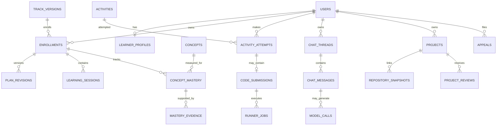
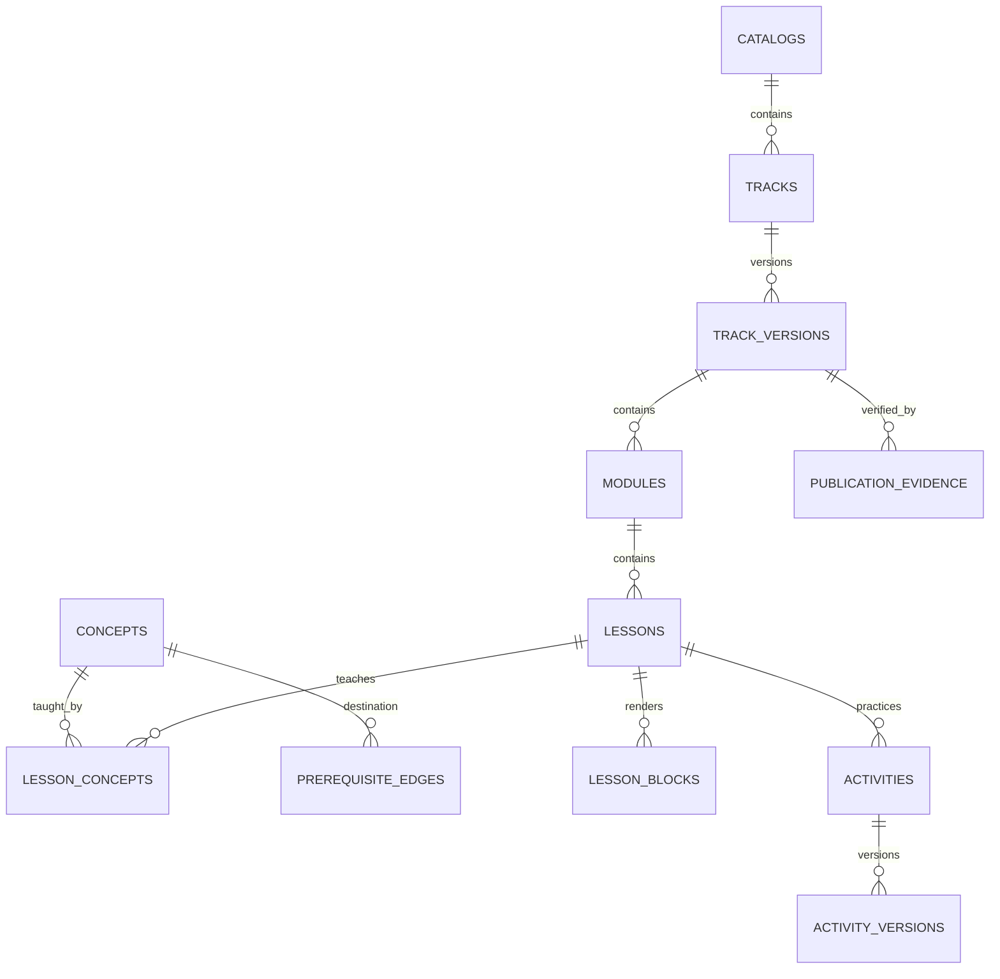
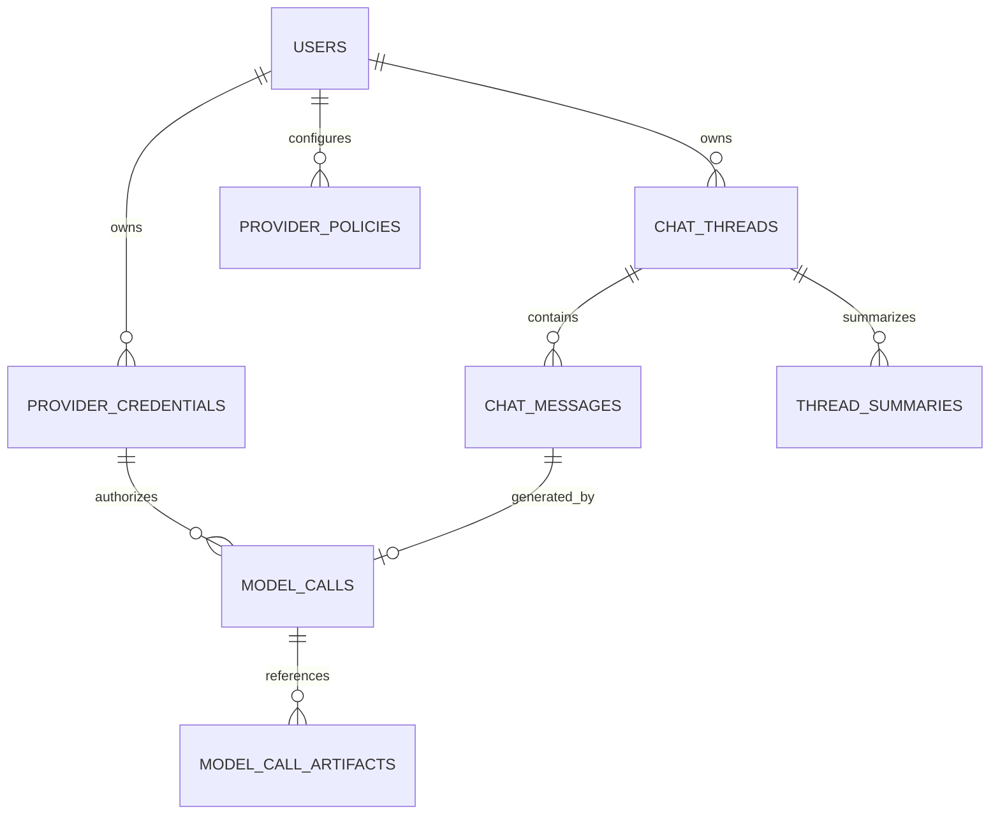

# Data Model

**Status:** Authoritative conceptual and logical model\
**Primary store:** PostgreSQL\
**Large-object store:** private local object storage with PostgreSQL manifests\
**Identity store:** Better Auth-generated Drizzle tables in PostgreSQL plus application policy/audit projections

All product schemas are implemented through reviewed Drizzle definitions and migrations. Raw SQL is permitted only for reviewed PostgreSQL-specific controls such as RLS, partial/specialized indexes, triggers, check functions, and advisory locking; it is committed beside the Drizzle migration that owns it.

## 1. Modeling conventions

### Identifiers and time

- Internal primary keys are opaque UUIDs generated by the application/database. Sequential public IDs are not used.
- Public sharing uses a separate random `public_id` that can be rotated without changing foreign keys.
- All mutable tables include `created_at` and `updated_at` as `timestamptz`; append-only tables include `occurred_at`.
- Timestamps are stored in UTC. `users.timezone` stores a validated IANA timezone for presentation/scheduling (`DAT-008`).
- Official decisions store the policy/content/test/runtime/prompt versions that produced them.

### Mutability

- Identity projections, profiles, preferences, drafts, and current read models may update in place with an integer `row_version` for optimistic concurrency.
- Curriculum publications, exam forms, submissions, grading results, mastery evidence, plan revisions, provider-call records, appeals, and audit events are append-only or immutable after finalization.
- Corrections append superseding records; they never overwrite historical official evidence.

### Ownership and authorization

- Every learner-private row carries `user_id` directly or reaches it through a non-null parent foreign key.
- PostgreSQL row-level security (RLS) is defense in depth. The application sets transaction-local `app.user_id`, `app.role`, and `app.audit_id` only after Better Auth validates the database-backed session.
- Background workers use narrowly scoped database roles and explicit job ownership, not a universal web credential.
- Admin read access is policy-gated and audited at the application layer; RLS does not imply every admin screen may bulk-export every table.

### Sensitive data

- Password hashes, database session tokens, OAuth account tokens, TOTP secrets, and backup-code material live only in the restricted Better Auth-generated tables. They are never projected into product/admin tables or exposed by generic APIs. Better Auth secrets and backup encryption are held outside PostgreSQL.
- Passkey private keys stay on authenticators; the Better Auth passkey table stores only public credential data.
- Provider API keys are AEAD ciphertext only. The key-encryption key is outside PostgreSQL/backups.
- Hidden tests and reference solutions use restricted server-only object references and never appear in browser-facing views or AI context tables.
- IP data is stored as a truncated/pseudonymized value where exact address is not operationally required.

## 2. Schema boundaries

| Schema | Responsibility |
|---|---|
| `auth` | Better Auth core/plugin tables generated for Drizzle: user, session, account, verification, two-factor and optional passkey |
| `iam` | Access requests, application user projection, roles, one-session policy/history, security events, consent |
| `profile` | Learner preferences, onboarding, interests, goals |
| `content` | Catalog, curriculum graph, versioned lessons, examples, tests, publication evidence |
| `learning` | Enrollment, plan revisions, sessions, mastery state/evidence, misconceptions, review schedule |
| `assessment` | Question banks, forms, attempts, exams, responses, grading evidence |
| `execution` | Code submissions, runner jobs/results, hidden bundle references, runtime images |
| `ai` | Provider credentials/policies, calls, chat, summaries, evaluations |
| `project` | Learner projects, artifacts, GitHub installations/snapshots, reviews/findings |
| `social` | Cohort profile projection, achievements, streaks, leaderboard periods/scores |
| `notification` | Preferences, inactivity episodes, outbox, deliveries, suppression |
| `support` | Appeals, content reports, learner feedback, admin decisions |
| `storage` | Object manifests, ownership, quotas, usage ledger, deletion/tombstones |
| `ops` | Durable jobs, feature/policy versions, health/cost aggregates, backup records |
| `audit` | Immutable actor/subject/action events and integrity chain metadata |

## 3. High-level relationships

## 4. Identity and access (`AUTH-*`, `SES-001`, `NFR-SEC-*`)

### Better Auth/Drizzle schema ownership

Better Auth is embedded in Next.js and uses the official [Drizzle PostgreSQL adapter](https://better-auth.com/docs/adapters/drizzle). The Better Auth CLI generates the core and enabled-plugin schema; generated Drizzle definitions and SQL migrations are committed, reviewed, and pinned to the deployed Better Auth/plugin versions. Production never runs an unreviewed automatic auth migration.

The logical tables below use readable names. The committed Drizzle mapping is authoritative if physical names differ.

#### `auth.user` (Better Auth core)

Core fields: `id` UUID PK, `name`, `email` unique/case-normalized policy, `email_verified`, `image nullable`, `created_at`, `updated_at`, plus plugin-managed `two_factor_enabled`. Configure Better Auth/PostgreSQL UUID generation consistently. Product-specific learning fields do not extend this table; they belong in `iam.users`/`profile.*`.

#### `auth.session` (Better Auth core)

Core fields include `id`, sensitive bearer-equivalent `token` unique, `user_id` FK, `expires_at`, `created_at`, `updated_at`, `ip_address nullable`, and `user_agent nullable`, following Better Auth's [database and session model](https://better-auth.com/docs/concepts/session-management). Sessions remain database-backed; stateless-only session mode and long-lived cookie-only caching are disabled because immediate revocation is required.

One-active-device enforcement is an application invariant implemented around Better Auth session creation/revocation with a serialized PostgreSQL transaction/advisory lock and a compatible unique/trigger guard verified against the generated schema. A new successful MFA login revokes the previous row before/while the replacement becomes usable. Multiple tabs share the same session token. Never duplicate the token into audit/projection tables.

Set the Better Auth session expiry/update policy to the approved 30-day remember behavior and a short `freshAge`. Set TOTP verification `trustDevice` to false; the database session is the remembered device, and a new login after revocation must re-run TOTP. Product-sensitive actions additionally check `iam.session_security.last_mfa_at`, because session freshness alone does not prove a recent second factor.

#### `auth.account` (Better Auth core)

Stores one identity account per provider: `id`, `user_id`, `provider_id` (`credential`, `google`), provider account ID, password hash for the credential provider, and provider token/scope/expiry fields generated by the pinned Better Auth version. Password values are scrypt hashes by default, never reversible. Request only Google identity scopes; do not request offline access or retain Google access/refresh tokens unless a separately approved feature needs them. If OAuth token columns are populated, treat them as Critical secrets, restrict them to the auth server role, and encrypt/minimize them through the supported integration design.

Unique constraints prevent one provider account from linking to multiple users. Linking requires verified email/provider proof and a recent authenticated flow; matching email alone is not sufficient unless Better Auth's verified-email policy and explicit link flow both pass.

#### `auth.verification` (Better Auth core)

Stores short-lived verification/reset/OAuth state records according to the generated schema: identifier, value/token material, expiry, timestamps. Tokens are purpose-bound, short-lived, one-use, and excluded from product logs/exports. Better Auth OAuth state/PKCE and origin checks stay enabled.

#### `auth.two_factor` (Better Auth two-factor plugin)

Generated fields include `id`, `user_id`, TOTP `secret`, `backup_codes`, `verified`, failed verification count, and lockout time as documented by the [Better Auth two-factor plugin](https://better-auth.com/docs/plugins/2fa). The plugin encrypts the generated secret and backup codes. Restrict the table to the Better Auth server role, keep the versioned `BETTER_AUTH_SECRET` outside PostgreSQL/backups, and test rotation. The plugin gates credential sign-in but not OAuth/social sign-in by default, so a custom hook must require TOTP after Google before a session becomes product-usable. The product shows newly generated backup codes during enrollment and otherwise permits only recent-MFA regeneration/replacement; it does not offer an admin or generic recovery-code reveal UI. Used codes must become unusable.

#### `auth.passkey` (optional approved Better Auth passkey plugin)

Stores public credential data only: ID/name, user ID, public key, credential ID, signature counter, device type, backed-up flag, transports, creation time, and AAGUID. Private keys remain on the authenticator. The production RP ID and origin exactly match the public application domain. Enabling this plugin requires its generated migration and browser compatibility/recovery testing.

#### Auth secret and database-role rules

- `BETTER_AUTH_SECRET`/versioned rotation material, Google client secret, email credentials, and BYOK KEK are root/container secrets outside PostgreSQL and backup repositories.
- The Next.js Better Auth server role can access auth tables; ordinary product query roles cannot select session tokens, password hashes, OAuth tokens, TOTP secrets, or backup codes.
- Drizzle application code imports separate safe projections rather than exposing generated auth rows to server components/client serialization.
- Better Auth database hooks/middleware enforce approved access and create safe security/audit events without copying secret fields.

### `iam.access_requests`

| Column | Type | Rules |
|---|---|---|
| `id` | uuid PK | opaque |
| `email_normalized` | citext | unique among open/approved request states |
| `display_name_requested` | text | length-limited and sanitized on output |
| `reason` | text nullable | optional, length-limited |
| `adult_confirmed_at` | timestamptz | required for approval baseline |
| `status` | enum | `pending`, `approved`, `rejected`, `expired`, `withdrawn` |
| `email_verified_at` | timestamptz nullable | required before approval |
| `decision_by` | uuid nullable FK `iam.users` | admin actor |
| `decision_reason` | text nullable | internal; audited |
| `decided_at` | timestamptz nullable | status-consistent check |

Indexes: `(status, created_at)`, unique lower/citext email for active states. Retain decisions according to access/audit policy; rejected free text should expire sooner than audit metadata.

### `iam.enrollment_tokens`

`id`, `access_request_id`, `token_hash` unique, `purpose`, `expires_at`, `consumed_at`, `consumed_by_user_id`, `created_by`, `created_at`. Store only a keyed hash of the bearer token. Consume with a single conditional update (`consumed_at IS NULL AND expires_at > now()`).

### `iam.users`

| Column | Type | Rules |
|---|---|---|
| `id` | uuid PK/FK `auth.user.id` | same stable Better Auth/application identity; one-to-one projection |
| `email_normalized` | citext unique | verified identity projection |
| `display_name` | text | private/default display |
| `public_id` | uuid unique | rotatable cohort URL identity |
| `timezone` | text | valid IANA zone |
| `status` | enum | `pending_mfa`, `active`, `suspended`, `deletion_pending`, `deleted` |
| `adult_confirmed_at` | timestamptz | copied proof event |
| `last_meaningful_activity_at` | timestamptz nullable | inactivity scheduler input |
| `row_version` | bigint | optimistic concurrency |

Email changes require an identity event and re-projection; do not accept a browser-provided email as ownership proof.

### `iam.user_roles`

Composite PK `(user_id, role)`, where role initially is `learner` or `admin`. Include `granted_by`, `granted_at`, `revoked_at`. A user may hold both but UI switching does not change authorization history.

### `iam.identity_links`

Safe read projection derived from `auth.account`: `id`, `user_id`, `provider` (`credential`, `google`), `provider_account_fingerprint`, `email_at_link`, `linked_at`, `unlinked_at`, unique active `(provider, provider_account_fingerprint)`. Password hashes and OAuth tokens are never copied here.

### `iam.session_security`

Better Auth's `auth.session` row is the active session authority. This one-to-one/safe projection supports product UI, recent-MFA gates, one-device semantics, and retained revocation history without copying the session token:

- `id`, `user_id`, `auth_session_id` (or irreversible hash after the auth row is deleted), `device_id_hash`;
- `created_at`, `last_seen_at`, `absolute_expires_at`, `revoked_at`, `revocation_reason`;
- normalized browser/OS label, approximate region, pseudonymized IP prefix;
- `mfa_method`, `last_mfa_at`, `replaced_session_id nullable`.

A partial unique constraint/serialized auth-session command ensures at most one active projection and one active Better Auth session per account, including admins. Multiple tabs share one session/device. When Better Auth deletes/revokes a session, hooks preserve the safe history row for the security-log period, then aggregate/delete it. Integration tests must prove no callback/race can leave two usable sessions.

### `iam.security_events`

Append-only: `id`, `user_id nullable`, `event_type`, `outcome`, `session_projection_id nullable`, `ip_pseudonym`, `user_agent_class`, `region`, `metadata_json` allowlisted, `occurred_at`, `correlation_id`. Event types include request verification, enrollment, login success/failure, MFA enrollment/failure/recovery, new-device replacement, logout/revoke, password/email change, provider/GitHub credential change, export/delete request. Default raw retention: 90 days.

### `iam.consents`

`id`, `user_id`, `consent_type`, `scope_json`, `policy_version`, `granted_at`, `withdrawn_at`, `source`. Examples: provider/data-category routing, admin fallback, cohort fields, leaderboard, mentor raw-chat visibility disclosure, and external processing/privacy acknowledgments. Mandatory cohort policies such as the generic admin inactivity notice use a versioned acknowledgment rather than being mislabeled as optional consent. Never infer an active consent from an old boolean; query the latest applicable version.

## 5. Profile and onboarding (`ONB-*`)

### `profile.learner_profiles`

One-to-one with user: `user_id` PK, `experience_level_self_report`, `preferred_session_minutes`, `weekly_goal_minutes`, `analogy_frequency`, `language_preference`, `onboarding_state`, `onboarding_completed_at`, `row_version`. These are preferences, not evidence.

### `profile.interests` and `profile.user_interests`

Admin-curated interest taxonomy (`cooking`, `cars`, `gaming`, etc.) with version/status. Join table stores `user_id`, `interest_id`, `weight/order`, `use_for_analogy`, `created_at`. Optional free text, if allowed, belongs in a separately length-limited field and is never cohort-public by default.

### `profile.learning_goals`

`id`, `user_id`, `goal_type`, `description`, `target_date nullable`, `status`, `created_at`, `completed_at`. Goal text is untrusted and excluded from external prompts unless the context assembler explicitly includes it.

## 6. Curriculum and publication (`CUR-*`, `LES-*`)

### Core catalog tables

- `content.catalogs`: `id`, `slug`, `name`, `status`, `created_at`.
- `content.tracks`: stable identity; `id`, `catalog_id`, `slug`, `name`, `track_type`, `default_language nullable`, `status`.
- `content.track_versions`: immutable publication; `id`, `track_id`, semantic `version`, `stage` (`draft`, `beta`, `verified`, `retired`), `scope_statement`, `supported_runtime_policy_id`, `source_commit`, `created_by`, `approved_by`, timestamps. Unique `(track_id, version)`.
- `content.modules`: version-owned ordered grouping; `id`, `track_version_id`, `slug`, `title`, `position`, `objective`.
- `content.concepts`: stable language-neutral identity; `id`, `slug`, `title`, `domain`, `description`, `criticality`, `status`.
- `content.track_concepts`: `(track_version_id, concept_id)`, module/order, required/elective, mastery-policy reference, language variant requirement.
- `content.prerequisite_edges`: version-scoped `from_concept_id`, `to_concept_id`, edge type, rationale. Unique edge; publication validator rejects cycles.

### Lessons

- `content.lessons`: immutable version-owned record: `id`, `track_version_id`, `module_id`, `slug`, `title`, `objective`, `estimated_minutes`, `difficulty`, `content_status`, `source_commit`.
- `content.lesson_concepts`: `(lesson_id, concept_id)`, `coverage_type` (`introduce`, `reinforce`, `assess`), `weight`.
- `content.lesson_blocks`: ordered typed blocks (`prose`, `analogy`, `code`, `callout`, `visualizer`, `quiz_embed`, `source`, `recap`); `payload_json` validated against a schema version; optional language and interest tags.
- `content.code_examples`: `id`, `lesson_id`, `language`, `runtime_image_id`, source object/text, expected output, stdin, compile flags allowlist reference, verification status/result hash.
- `content.source_citations`: authoritative URL/title/publisher/accessed date, scope and lesson/concept join. Long copyrighted text is not copied.
- `content.common_misconceptions`: `id`, `concept_id`, code, learner-safe description, detection hints, remediation lesson/activity references.

### Activities and versions

- `content.activities`: stable identity, type (`micro_check`, `quiz`, `trace`, `debug`, `code`, `project`, `exam_blueprint`), concept, slug.
- `content.activity_versions`: immutable specification with instructions, language, difficulty, scoring policy, hint ladder, visible examples, critical criteria, content/source version, status.
- `content.hints`: ordered by activity version, reveal level, body/payload, solution-revealing flag.
- `content.test_bundles`: `id`, `activity_version_id`, `version`, restricted object ID, harness hash, runtime image, visible/hidden counts, created/verified/approved actors. Browser/API roles cannot select restricted object reference/body.

### Publication evidence

`content.publication_runs` records requested version, source commit, validator versions, status, timestamps, actor. `content.publication_evidence` records evidence type (`coverage`, `prerequisite_dag`, `example_compile`, `test_suite`, `language_parity`, `source_review`, `accessibility`, `admin_approval`), subject, status, artifact/checksum, details, reviewer. A verified stage requires all policy-mandated evidence successful.

## 7. Enrollment, plans, sessions, and mastery (`ADP-*`, `SES-*`)

### `learning.enrollments`

`id`, `user_id`, `track_version_id`, selected implementation language, `status`, `started_at`, `completed_at`, current plan revision, placement result, source (`self`, `diagnostic`, `admin`). Unique one active enrollment per user/track family unless explicitly allowed.

### `learning.plan_revisions`

Immutable snapshot/delta: `id`, `enrollment_id`, `revision_number`, `parent_revision_id`, `created_by`, `reason`, `source` (`adaptive`, `learner`, `admin`, `migration`), `policy_version`, `plan_json`/normalized child rows, `created_at`. Unique `(enrollment_id, revision_number)`. `learning.plan_items` stores ordered concept/activity, status/gate, due date, and rationale. Admin changes never overwrite the prior revision.

### `learning.learning_sessions`

`id`, `user_id`, `enrollment_id`, `plan_revision_id`, `goal`, `planned_minutes`, explicit `review_only` (default false), `status` (`active`, `inactive`, `ended`, `abandoned`), `started_at`, `last_activity_at`, `ended_at`, `row_version`. A new session references existing mastery; it does not create a new learner identity or reset evidence. Review-only policy is activated only by the validated boolean choice; free-text goal wording is never interpreted as authority.

### `learning.session_events`

Append-only meaningful product events: activity start/complete, lesson block viewed where necessary, hint request, explanation mode, answer, code submission link, reflection, recommendation shown/chosen, session end. Store event type, subject IDs, bounded metadata, correlation, client event ID (unique per user for offline/idempotent sync), server time, optional client time. Do not use this table for raw clickstream or covert surveillance.

### `learning.concept_mastery`

Current read model keyed `(user_id, enrollment_id, concept_id, language_context)`:

- `score` constrained 0–100;
- `status` enum;
- `confidence` 0–1;
- `critical_requirements_met` boolean/bitset reference;
- `last_evidence_at`, `last_practiced_at`, `next_review_at`;
- `mastery_policy_version`, `last_event_sequence`, `row_version`.

This table is rebuilt from evidence and policy if needed; it is not the sole historical source.

### `learning.mastery_evidence`

Append-only: `id`, user/enrollment/concept, language, `evidence_type`, source attempt/submission/exam/project/admin decision, score/value, weight, critical criterion, validity (`valid`, `invalidated`, `superseded`), policy version, recorded_at, recorded_by. Unique idempotency constraint on source/type/criterion. Overturned appeals append invalidation/correction evidence.

Formal faulty-test corrections are implemented by `assessment_correction` and its append-only event/impact/outcome/mastery-adjustment tables. Each impact stores canonical form, answer-set, original-result, and complete-snapshot hashes. A corrected result appends a revision and optional superseded-outcome pointer; `assessment_attempt_effective_result` is a replaceable read projection, never the evidence source. Module badge awards/revocations update only the `user_achievement` projection while `assessment_mastery_adjustment` preserves the correction history. `assessment_mastery_projection_repair` is a mutable, retryable work/projection row: it records exact concept/enrollment resolution, before/after projection snapshots, correction-owned evidence, row-version guard, attempts, and an applied or unresolved resolution code. The snapshots remain admin/server-only and are excluded from learner export.

### `learning.user_misconceptions`

`id`, user/concept/misconception, first/last detected, occurrence count, confidence, status (`suspected`, `active`, `resolved`, `recurring`), source evidence, next remediation. Model classifications cannot become active without rule threshold or review.

### `learning.review_schedule`

`id`, user/enrollment/concept, due_at, interval policy/version, reason, status, generated_from_evidence_id, completed_attempt_id. Index `(user_id, status, due_at)` drives home/review queue.

## 8. Assessment and exams (`ASM-*`, `EXM-*`)

### Question/form design

- `assessment.question_items`: stable item identity and concept mapping.
- `assessment.question_versions`: immutable prompt/spec, type, answer schema, rubric, explanation, language/runtime, difficulty, misconception mappings, source/content version, status.
- `assessment.assessment_blueprints`: versioned purpose, concept/skill coverage, item-type quotas, difficulty distribution, critical clusters, time and scoring policy.
- `assessment.forms`: generated immutable form with blueprint version, randomization seed, item versions/order, equivalence metadata, created_at.
- `assessment.form_items`: form position, question version, points, critical cluster, per-form variant data.

### Attempts and responses

- `assessment.attempts`: `id`, user, activity/form, kind (`practice`, `diagnostic`, `mastery_check`, `exam`, `retake`), attempt number, status, policy/form/content versions, server-authoritative assistance level/solution-reveal/help step, started/submitted/graded timestamps, score, pass/mastery outcomes, infrastructure-failure flag.
- `assessment.practice_help_events`: append-only owner/request/attempt-bound receipts for each sequential help step, kind, durable assistance level and reveal flag. Help text and private solutions remain in immutable published activity specifications; creation payloads expose only counts, and the help endpoint returns exactly the already-persisted step.
- `assessment.responses`: attempt + form item, response version, typed `response_json`, saved_at, submitted_at, source (`browser`, `autosave`, `expiry`), row version. During an active exam, optimistic updates preserve revision history or a bounded autosave journal.
- `assessment.grading_evidence`: append-only criterion result, grader type (`deterministic`, `runner`, `model`, `admin`), points, rationale, source IDs, rubric/model/prompt/runtime/test versions, created_at.
- `assessment.attempt_decisions`: final/superseding score/pass/mastery decision, policy version, evidence set checksum, decided_by/type, rationale, supersedes ID.

### Exams

- `assessment.exam_sessions`: attempt/form, server start/deadline, status, accommodation policy, last heartbeat/save, disconnect totals, finalization source, integrity review state.
- `assessment.exam_events`: disclosed allowlist only: start/end, question navigation, save, compile/run, submit, focus loss, fullscreen exit, paste event size (not content), reconnect, server error. Retain 90 days by default unless attached to an open appeal.
- `assessment.exam_integrity_reviews`: reviewer, signals summary, learner response, decision/rationale. Model flags do not determine guilt.
- `assessment.retake_eligibility`: source attempt, remediation requirements, earliest_at, equivalent blueprint, consumed_by_attempt.

## 9. Code execution (`RUN-*`)

### `execution.runtime_images`

`id`, language, display version, compiler/interpreter version, OCI digest, standard/default flags, runner compatibility, status, verified_at, security_scan_artifact. Published activities point to an immutable active image ID.

### `execution.code_submissions`

Durable logical submission: `id`, user, nullable attempt/activity, language, bounded source, source hash, submission type, opaque request ID, canonical request hash, runtime image digest, nullable test bundle, status, and created time. `(user_id, request_id)` is unique, so an exact retry reuses the same local submission and a changed payload under that ID is rejected. A partial unique index permits at most one active (`queued`, `leased`, or `running`) `exam_final_test` or `assessment_correction_regrade` submission per learner. Practice `server_run`/`server_compile` submissions are deliberately outside that official slot and cannot become mastery evidence.

### `execution.runner_jobs`

`id`, unique `submission_id`, status, priority, bounded limits, remote job identifier, safe result, optional immutable practice-only dispatch snapshot, and queue/start/completion times. Submission and job are admitted in one database transaction before any remote request. Practice dispatch atomically stores the exact bounded source/stdin/runtime request before the remote boundary; it contains no credential or hidden test. Dispatch and terminal settlement use learner-scoped locking and compare-and-set transitions; terminal truth cannot be overwritten by a late response and releases the official slot. A queued official admission proven not to have crossed the dispatch boundary can fail without mastery evidence after the bounded stale threshold. Leased official work remains on its durable worker generation, while stale leased practice work is reconciled by the dedicated same-request worker. Each signed HTTP request times out after 15 seconds, below that threshold. The isolated service separately journals source-free job/idempotency state atomically: terminal jobs survive restart and prior queued/running jobs become a signed retryable `RUNNER_RESTART_RECOVERED` result rather than disappearing.

### `execution.runner_results`

`id`, runner_job_id unique, request/source hash echo, compile status, exit/status, bounded stdout/stderr object/text, CPU/wall/memory/output values, aggregate test counts, signed result, result hash, created_at. Sensitive harness errors are stored in an admin-restricted field or object and never browser-visible.

### `execution.test_results`

Per opaque test: `runner_result_id`, ordinal/opaque test ID, category, status, time/memory, learner-safe feedback code. No hidden input/expected output column is available to application/browser read roles.

## 10. AI, credentials, chat, and memory (`AI-*`, `SES-003`)

### `ai.provider_credentials`

| Column | Type | Rules |
|---|---|---|
| `id` | uuid PK | opaque |
| `owner_user_id` | uuid nullable | learner-owned; null only for separately flagged admin fallback |
| `provider` | enum/text | allowlisted adapter |
| `label` | text | no secret content |
| `ciphertext` | bytea | AEAD ciphertext |
| `nonce` / `auth_tag` | bytea | algorithm-specific |
| `key_version` | integer | KEK/envelope rotation |
| `fingerprint` / `last_four` | text | non-secret display/dedup hint |
| `status` | enum | `pending_validation`, `active`, `invalid`, `disabled`, `revoked`, `deleted` |
| `allowed_tasks` | text[] | chat/hint/code/project etc. |
| `last_validated_at`, `last_used_at` | timestamptz | operational |
| `deleted_at` | timestamptz | ciphertext cryptographically/physically removed per policy |

No `plaintext`, `revealed_at`, or reversible admin-export endpoint exists. RLS limits owner metadata; ciphertext is accessible only to the gateway database role/function.

### Routing and budget

- `ai.provider_policies`: user, ordered provider credential/model candidates, task/data-category consent references, NIM preference rule, admin fallback opt-in, effective dates, version.
- `ai.usage_budgets`: owner/provider/model/task period, hard/soft token/request/cost limits, current aggregate, currency/rate-source version.
- `ai.model_catalog`: provider model ID, capability flags, context/output limits, status, pricing metadata source/date, privacy/retention policy link.

### Chat

- `ai.chat_threads`: user, optional learning session/concept/project, title, status (`active`, `archived`, `deleted`), created/last message, current summary version, row version.
- `ai.chat_messages`: thread, ordinal, role (`learner`, `assistant`, `system_notice`, `admin`), content object/text, content hash, visibility, model_call_id nullable, reply-to, created_at, deleted/tombstone state. Unique `(thread_id, ordinal)`.
- `ai.thread_summaries`: thread, version, covered message range/checksum, structured summary JSON (goals, decisions, misunderstandings, unresolved questions), generated/reviewed by, model/prompt version, created_at.
- `ai.learner_memory_facts`: user, type, structured value, provenance, confidence, status, sensitivity, allowed contexts/providers, effective/expired times. User preferences and deterministic mastery should normally be read from their source tables instead of duplicated.

### Model calls and evaluations

- `ai.model_calls`: operation, user, provider/model, credential ID or admin fallback marker, prompt template version, context-manifest hash, consent/policy version, request/response IDs, status, token counts, estimated/final cost, latency, fallback parent/reason, schema validation, content/runtime versions, timestamps. Raw secrets never stored.
- `ai.model_call_artifacts`: references to bounded prompt/response artifacts only when retention policy permits, with sensitivity and deletion date. Prefer hashes/structured outputs over indefinite raw provider payloads.
- `ai.prompt_templates`: immutable name/version, operation, system/instruction content, schema, approved models, status, source commit, approval evidence.
- `ai.eval_suites`, `ai.eval_cases`, `ai.eval_runs`, `ai.eval_results`: golden case/version, expected criteria, model/prompt/content version, correctness/safety/leakage/style results, reviewer, release gate.

## 11. Projects, objects, and GitHub (`PRJ-*`, `DAT-002`)

### Launch 1 `project`

`id`, `user_id`, title, summary, status, visibility, bounded PRD JSON, optional public GitHub URL and pinned commit SHA, created/updated. Cohort visibility is independent of object access.

### Launch 1 append-only project revisions/files

- `project_revision`: project, monotonically increasing sequence, client request UUID, canonical input hash, learner-written change summary/reflection, created-at. Unique `(project_id, sequence)` and `(project_id, client_request_id)` provide serialized optimistic concurrency and durable exact replay. Database triggers reject updates; there is no mutation endpoint.
- `project_revision_object`: revision/ordinal, nullable existing object reference, and immutable original name/media type/size/SHA-256 snapshot. Only owner-matching, undeleted, `safe`, `user_upload` objects enter through the service. The link adds no quota ledger row and copies no bytes. Object erasure may set only the live reference to null; snapshot fields remain until project/account deletion.
- Create/list/detail APIs bind project and revision through the authenticated owner. A revision action never starts AI, runner execution, GitHub fetch, or static review.

### Planned GitHub expansion (not Launch 1 evidence)

- `project.github_installations`: user, GitHub installation/account IDs, encrypted token reference/refresh metadata, permissions snapshot, status, linked/unlinked times. No PAT field.
- `project.repository_links`: project, installation nullable/public, owner/repo, visibility, default branch, allowed repository ID, linked_at.
- `project.repository_snapshots`: link, immutable commit SHA, branch/tag label, manifest object, fetched_at, fetch policy/version, size/file counts, scan result, expiry/pinned state.

### Review

- Launch 1 `project_review` stores project, immutable public commit SHA, analyzer version, optional model-call reference, bounded findings, status and created-at. It remains isolated from project revision files.
- Future `project.reviews`: project/revision/snapshot, review type, objectives/rubric, status, requested/completed, analyzer/model/prompt versions, environment/runtime, result summary.
- `project.review_findings`: review, category, severity, file/path/line nullable, message, evidence hash, source (`static`, `runner`, `model`, `admin`), confidence, status, supersedes.
- `project.review_commands`: approved template ID, exact command/args, network/dependency policy, result job; never accept an arbitrary browser shell string.

### Storage

- `storage.objects`: `id`, storage key generated server-side, owner user nullable, category, content hash, byte size, media type, encryption/checksum metadata, scan status, created_at, expires_at, deleted_at. No public ACL.
- `storage.object_references`: object ID, owning domain/table/row, reference type, created/deleted. Prevent delete while active references remain.
- `storage.user_quotas`: user, limit bytes (2 GB default, max 3 GB without policy change), reserved/used bytes, updated_at, row version.
- `storage.usage_ledger`: append-only allocation/reservation/release transaction with object/job/idempotency key. Reconcile regularly against object manifests.
- `storage.deletion_tombstones`: target, requested/effective/purge dates, reason, backup expiry, status.

Objects used only for compiler/repository temporary work expire within hours/days and do not consume durable quota after cleanup. Shared curriculum objects have no learner owner and separate capacity accounting.

## 12. Social (`SOC-*`)

- `social.profile_visibility`: user PK, discoverable, alias, avatar object, field flags for badges/streak/projects/mastery, leaderboard opt-in, policy version, updated_at.
- `social.public_profile_projection`: user/public ID, only approved denormalized fields; rebuilt on visibility change. This is the only cohort-profile query source.
- `social.achievement_definitions`: immutable versioned criteria, icon/text, status.
- `social.user_achievements`: user, definition/version, qualifying evidence checksum, awarded/revoked times, visibility.
- `social.streak_daily`: user/local date/timezone version, qualifying-event type/count, frozen/corrected status. Timezone changes do not rewrite old days.
- `social.leaderboard_periods`: period/rules version/start/end/status.
- `social.leaderboard_scores`: period, user, score, component JSON, rank projection, computed_at. Source events are capped and authoritative; opt-out removes public projection, not private achievements.

## 13. Notifications (`NOT-*`)

- `notification.preferences`: user, IANA timezone, quiet start/end/local days, temporary pause state/reason/expiry/actor, acknowledged inactivity-policy version, security-notification constraints, updated_at. Core inactivity learner/admin notices follow the approved cohort policy rather than an undisclosed marketing opt-in.
- `notification.inactivity_episodes`: user, trigger threshold, last meaningful activity, eligible_at, status (`eligible`, `queued`, `sent`, `cancelled`, `resumed`), sent notification IDs. Unique one open episode/user.
- `notification.templates`: name/version/channel/locale, subject/body, sensitivity classification, approved_at/by.
- `notification.outbox`: transactional message intent, user, template/version, dedupe key unique, scheduled_at, payload allowlist, status, attempt count, next attempt, created_at.
- `notification.deliveries`: outbox, provider ID, attempt, status, sent/delivered/bounced/complained times, error code. Avoid indefinite body storage.
- `notification.suppressions`: normalized address hash/user, reason, source, active dates.

The backup system writes a status notification, never a backup attachment or recovery key.

## 14. Appeals, reports, and admin/audit (`ADM-*`, `RUN-007`, `DAT-007`)

### `support.appeals`

`id`, user, target type/ID, original evidence-manifest hash, category (`code_result`, `assessment`, `AI_claim`, `project_finding`, `plan_decision`, `integrity_review`), learner statement, status, assigned admin, created/updated/closed. A partial unique index prevents duplicate open appeal for the same target/category.

### `support.appeal_events`

Append-only actor/role, event (`submitted`, `triaged`, `request_info`, `learner_reply`, `rerun`, `decision`, `reopen`), content/evidence object, model/runtime/policy references, occurred_at. Final decision includes `upheld`/`overturned`/`superseded`, rationale, corrective evidence ID, and actor.

### `support.content_reports`

User, content version/block/activity, category, report text, screenshot/object optional, status, resolution/publication link. Reports never mutate published content directly.

### `audit.events`

Append-only:

- `id`, `occurred_at`, `actor_user_id`, `actor_role`, `subject_user_id nullable`;
- `action`, `resource_type`, `resource_id`, `purpose/reason`, `outcome`;
- bounded before/after diff or hashes, correlation/request IDs, session/view-as IDs;
- `previous_event_hash`, `event_hash` for tamper-evident batches where implemented.

Audit actions include access decisions, role changes, raw learner detail access, mentor/view-as, plan edits, content approvals/publication, provider credential lifecycle (not secret), fallback policy, GitHub link, regrade/appeal, export/delete, retention override, feature/policy changes, backup/restore administration. Default retention 12–24 months; open incidents/appeals hold relevant events.

## 15. Operations and backup records (`DAT-004`, `NFR-OPS-*`)

- `ops.jobs`: type, version, owner/resource, payload reference, priority, state, attempts/max, run-after, lease owner/expiry, idempotency key, error code, timestamps. Use `FOR UPDATE SKIP LOCKED`; payloads exclude plaintext secrets.
- `ops.dead_letters`: failed job snapshot, safe error, first/last failure, resolution actor/status.
- `ops.policy_versions`: named policy (`mastery`, `retention`, `routing`, `quota`, `exam`, `runtime_limits`), version, immutable JSON, effective/retired dates, approved by.
- `ops.feature_flags`: name, scope/user/cohort, value, expiry, reason, actor; security controls cannot be silently disabled by ordinary flags.
- `ops.backup_runs`: backup ID/type, started/completed, source checkpoint, encrypted repository snapshot ID, target (`local`, `offsite`), byte counts, checksum/integrity status, retention class, expiry, error, software version.
- `ops.restore_tests`: backup snapshot, clean target, started/completed, status, verified entity counts/checksums, sampled login/object/appeal outcomes, tester, report object.
- `ops.provider_cost_daily` and `ops.runner_usage_daily`: aggregates; detailed truth remains model calls/jobs.

## 16. Retention baseline (`DAT-001`, `DAT-003`)

| Data class | Online retention default | Notes |
|---|---:|---|
| Account, enrollment, plan, mastery, achievements, projects explicitly saved | account life | export/delete applies; legal/security holds explicit |
| Raw chat and ordinary code submissions | 12 months | keep structured summaries and official evidence longer; user deletion where allowed |
| Official graded/exam/project evidence and appeal artifacts | account life or 24 months after course completion | required for reproducibility; exact policy to approve |
| AI provider call metadata | 12 months | raw prompt/response shorter/minimized; cost/audit aggregates longer |
| Auth/security and exam behavior events | 90 days | extend only for open incident/appeal |
| Admin audit | 12–24 months | no secrets/raw recovery data |
| Notification delivery metadata | 90 days | templates/policy versions retained |
| Rejected access-request free text | 30–90 days | retain minimal decision/audit metadata longer |
| Temporary runner/repository/build objects | hours to 7 days | pinned appeal evidence excepted |
| Deleted online data in backup | ages out in 7 daily/4 weekly/12 monthly cycle | user-facing deletion explains backup window |

Retention jobs write deletion manifests and audit counts. Foreign keys use deliberate `RESTRICT`, tombstone, or cascade policies; avoid blanket cascading from `users` that would accidentally destroy audit or cross-domain evidence before export/hold resolution.

## 17. Indexes, constraints, and scaling

Required patterns:

- unique idempotency keys for outbox, offline session events, runner submission, and jobs;
- partial indexes for active sessions, credentials, appeals, enrollments, and inactivity episodes;
- `(user_id, occurred_at DESC)` on learner event/message/attempt tables;
- `(status, run_after)` on jobs/outbox;
- `(user_id, status, due_at)` on review schedule;
- GIN only for evaluated JSON/search needs; important filter/join fields remain normalized;
- full-text search over authored content and the user's own permitted chats/projects, never a global cross-user index;
- check constraints for scores, quotas, statuses, timestamps, and actor/subject combinations;
- deferrable or publication-time validation for prerequisite DAG and plan prerequisite consistency;
- partition high-volume append-only events by month only when observed size/retention warrants it; ten users do not justify premature partitioning.

## 18. RLS policy outline

| Table group | Learner | Admin | Worker/system |
|---|---|---|---|
| Own profile, preferences, sessions, chats, projects, credentials metadata | select/update own allowed columns | policy-gated select; no ciphertext/reveal; audited sensitive read | scoped job role |
| Mastery, attempts, results, plans | select own; create through domain functions; no direct official update | select; plan/decision through append-only commands | adaptive/grading role |
| Cohort projection | select only rows/fields projected as visible | select | projection worker |
| Curriculum published | select published | draft/review via commands | publication role |
| Hidden tests, runner internals | none | restricted metadata only | runner/grader role |
| Audit/security | own limited security events | authorized operational views | append-only writer; retention role |
| Objects | signed/authorized own reference | purpose-gated | object/backup worker |

Database roles should not rely on a client-controlled role value. The server validates the Better Auth session, loads the application role, and then sets transaction-local values. Security-definer functions are minimal, schema-qualified, have fixed `search_path`, and receive review.

The Launch 1 mentor evidence reader is a server-side projection, not generic table access or impersonation. It accepts category, enumerated purpose, reason, cursor and limit only in a POST body; binds every SQL query to one resolved learner owner; requires fresh MFA and an administrator rate budget; writes `mentor.evidence.read` for success, denial or failure; and withholds content if the success audit cannot be committed. Category-specific allowlists exclude credentials, auth/session/IP/device fields, hidden blueprints/tests/reference answers, runner test bodies/digests/hashes and every other learner. Each sanitized item is capped at 48 KiB before response pagination, each page is at most ten top-level records and 128 KiB, and responses use no-store headers. Oversized items carry explicit truncation metadata; page sizing always retains at least one bounded item, so `hasMore` can never be returned without a continuation cursor.

## 19. Data integrity and transaction boundaries

Critical transactions:

1. **Enrollment:** consume token + create/link user + role/profile shell + audit/outbox.
2. **New-device login projection:** revoke previous active family + create new projection + security event/outbox.
3. **Attempt finalization:** lock attempt + persist final responses + grading evidence/decision + mastery evidence + update mastery/read plan + notification/event.
4. **Runner acceptance:** validate signature/hash + select one authoritative result + attach grading evidence; infrastructure failures create no learner penalty.
5. **Plan edit:** append revision/items + set current revision + audit diff + learner notification.
6. **Credential replacement:** encrypt new credential + disable old + audit/outbox; never log plaintext.
7. **Publication:** verify evidence set + append immutable published version + atomically expose catalog pointer + audit.
8. **Appeal overturn:** append decision + invalidate/supersede evidence + recompute mastery + plan revision if needed + notify.
9. **Quota allocation:** reserve before upload + finalize object/reference/ledger or release reservation.
10. **Deletion:** freeze target + export/hold check + revoke credentials/sessions/integrations + tombstone/purge workflow + audit.

## 20. Backup coverage and capacity

The backup manifest includes:

- application PostgreSQL dumps including the reviewed Better Auth/Drizzle tables, plus the exact auth configuration/plugin/schema versions required for recovery (but not colocated runtime secrets);
- learner and curriculum object-store data;
- source/configuration version identifiers and migration state;
- encrypted credential ciphertext (usable only with separately recovered KEK);
- backup metadata/checksums and restore instructions.

It excludes rebuildable compiler/container caches, temporary checkouts, rotating operational logs past policy, and plaintext secrets. With ten learners at 2 GB, durable user objects alone can reach 20 GB (30 GB at the admin ceiling); a 32 GB USB cannot hold the full primary set plus 23 restore points. The approved baseline is a deduplicating 1–2 TB local target and a paid, dedicated Google Drive capacity sized from actual repository growth.

## 21. Migration and test requirements

- Every migration is forward-only in production, transaction-safe where PostgreSQL permits, and includes compatibility/rollback operational notes.
- Destructive column/table removal follows expand → backfill → switch → retention wait → contract.
- Seed data is versioned and contains no production learner information or secrets.
- Schema contract tests ensure browser/API roles cannot select ciphertext, hidden tests, or other users.
- Property tests cover idempotency, mastery replay, quota ledger reconciliation, one active session, and append-only correction.
- Restore tests verify row/object counts and sampled hashes, then exercise login, lesson resume, project file, official result, and appeal evidence.

## 22. Open data decisions

1. Exact retention for official graded evidence after account/course completion.
2. Whether any raw learner chat/code is retained beyond 12 months by learner opt-in.
3. Whether private GitHub repository snapshots persist or only commit SHA/review output persists.
4. Whether the 3 GB quota ceiling may be exceeded for selected projects and who approves it.
5. Whether vector embeddings are needed; if so, which fields/providers, deletion behavior, and retention apply.
6. Whether a second admin/dual approval is required for identity recovery, verified publication, or bulk regrading.
7. Exact backup Google account capacity and offsite repository expiry behavior.
