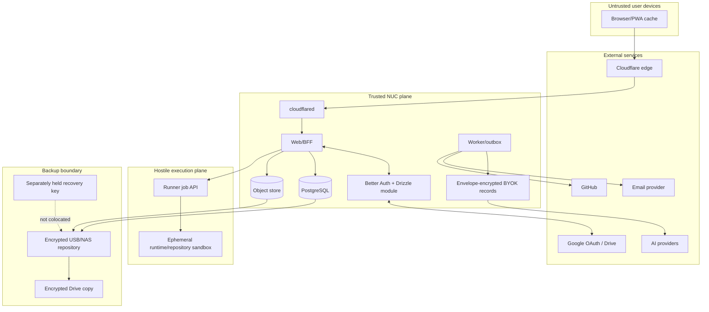

# Threat Model

**Status:** Authoritative security baseline\
**Method:** Asset/trust-boundary analysis with STRIDE-informed abuse cases\
**Scope:** Browser, Cloudflare ingress, identity, trusted NUC services, external providers, runner VM, GitHub, email, local/offsite backup, and operator workflows

## 1. Security objectives

1. A learner can access and change only their own private data and explicitly cohort-visible data.
2. An administrator can mentor and operate the product without learning passwords, MFA secrets, or recovery codes. Provider keys remain masked in ordinary work; an exceptional plaintext reveal uses the approved fresh-MFA/reason/audit/learner-notification ceremony.
3. Learner code and repositories cannot access the trusted host, database, home LAN, secrets, other learners, or unrestricted internet.
4. Official grades, mastery changes, content publication, plan edits, and appeals are attributable and reproducible.
5. External AI receives only consented, bounded context and cannot become the authority for hidden tests, mastery, publication, or appeals.
6. Loss of the NUC, disk, Google account, or a provider does not silently destroy the only recoverable copy of learner data.
7. Public/cohort features do not expose private activity, identity, code, or learning difficulty.
8. Security controls remain proportionate to an adult invite-only cohort without pretending that a small cohort is inherently safe.

## 2. Scope, assumptions, and exclusions

### In scope

- request-access approval, Google/password authentication, MFA, recovery, and sessions;
- learner/admin roles, mentor view, plan editing, and any future view-as;
- curriculum, assessments, exams, mastery evidence, social features, and appeals;
- BYOK storage and consent-aware provider fallback;
- learner messages, code, projects, GitHub integration, and model context;
- Cloudflare Tunnel and local NUC networking;
- PostgreSQL, object storage, trusted containers, KVM runner VM, and runtime containers;
- email and notification links;
- nightly local and weekly encrypted Google Drive backups;
- logs, metrics, exports, retention, and deletion.

### Assumptions

- Learners are 18+ at enrollment; admitting a minor requires a new privacy/legal review.
- The NUC operator has physical and root access and is trusted to administer the host, but accidental misuse and compromised admin credentials remain threats.
- No public router port forwards expose the origin.
- The installed Ubuntu LTS, Next.js/Better Auth/Drizzle stack, PostgreSQL, container runtime, runner, and dependencies are kept supported, pinned, and patched.
- AI-provider, GitHub, Google, Cloudflare, and email accounts have MFA and recovery controls.
- Best-effort availability is accepted; confidentiality, integrity, and recoverability are not waived.

### Out of scope for the initial release

- a native lockdown exam browser;
- camera, microphone, screen recording, raw keystroke, or clipboard-content monitoring;
- unrestricted package installation or internet access from learner code;
- native learner-laptop execution agent;
- public anonymous accounts or public course marketplace;
- local LLM/NIM inference.

## 3. Assets and impact

| Asset | Confidentiality | Integrity | Availability/recoverability |
|---|---|---|---|
| Password hashes, MFA state, recovery codes, sessions | Critical | Critical | High |
| Per-user provider keys and optional admin fallback key | Critical | Critical | High |
| Learner identity, profile, chats, code, attempts, admin notes | High | High | High |
| Hidden tests, reference solutions, exam forms | High | Critical | Medium |
| Mastery evidence, grades, plan revisions, appeals | Medium/High | Critical | High |
| Curriculum and publication approvals | Medium | Critical | High |
| GitHub installation tokens/private source | Critical where private | High | Medium |
| Audit/security events | High | Critical | High |
| Backup repositories and encryption keys | Critical | Critical | Critical |
| Tunnel, host, runner, database, email, GitHub credentials | Critical | Critical | Critical |
| Cohort profile, leaderboard, badges | User-controlled | High | Medium |
| System health, cost, quota, runtime images | Medium | High | High |

## 4. Actors

- **Learner:** legitimate user who may make mistakes, submit hostile code, probe tests, or abuse quotas.
- **Administrator/mentor:** privileged operator; may err, overreach, have a compromised session, or intentionally misuse access.
- **External attacker:** unauthenticated party targeting access, origin, identities, links, dependencies, or denial of service.
- **Malicious repository/dependency:** code designed to run during clone/build/test or to exfiltrate secrets.
- **Prompt attacker:** learner content, repository text, lesson text, or provider output attempting to override model/application policy.
- **Compromised provider/subprocessor:** AI, Cloudflare, Google, GitHub, email, or storage account/service exposing or modifying data.
- **Physical attacker:** steals or accesses NUC, USB/NAS, router, operator laptop, or recovery material.
- **Fault:** disk failure, power loss, data corruption, software bug, misconfiguration, or provider outage.

## 5. Trust-boundary/data-flow model

## 6. Risk scale

- **Likelihood:** 1 rare, 2 unlikely, 3 plausible, 4 likely, 5 expected.
- **Impact:** 1 negligible, 2 limited, 3 material, 4 severe, 5 critical.
- **Score:** likelihood × impact before controls.
- **Treatment:** mitigate, avoid, transfer, or explicitly accept. Residual High/Critical risk blocks pilot unless the product owner records acceptance and compensating controls.

## 7. Threat register

### 7.1 Identity, sessions, and authorization

| ID | Threat / STRIDE | Initial | Required controls | Verification / residual |
|---|---|---:|---|---|
| TM-AUTH-001 | Attacker requests access under another person's email or reuses an enrollment link (S) | 12 | Verify email before queueing; one open request/email; admin review; random single-use 24-hour token stored as a hash; consume atomically; neutral status responses (`AUTH-001`). | Link reuse/expiry/race E2E; enumeration comparison. Residual Low. |
| TM-AUTH-002 | Google/login endpoint bypasses cohort approval or creates duplicate identity (S/E) | 20 | Fixed Better Auth base URL and exact trusted origins/callback; before-hook requires approved unconsumed enrollment context for every first creation; prevent implicit Google provisioning; link only verified matching identities through explicit flow; keep CSRF/origin checks enabled (`AUTH-002`, `AUTH-003`). | Direct sign-up, unapproved Google, forged enrollment cookie, duplicate and linking tests. Residual Low. |
| TM-AUTH-003 | Password stuffing, weak reset, or emailed/generated password compromises account (S) | 16 | Never email passwords; one-time reset/set links; Better Auth rate/origin/enumeration protections kept enabled; reviewed scrypt password hashing (or separately reviewed custom hash); MFA required; neutral errors. | Template scan, reset-token race/expiry, rate-limit/config test. Residual Medium. |
| TM-AUTH-004 | MFA bypass on Google/social sign-in, recovery abuse, or stolen recovery code (S/E) | 20 | Mandatory TOTP for all users; `allowPasswordless` only to let Google-only users enroll/manage TOTP; custom hook gates OAuth/social completion because Better Auth does not apply 2FA there by default; email OTP is not the independent factor; encrypted one-use backup codes; recent MFA for sensitive actions; admin recovery requires identity procedure, reason, evidence, audit and notification. | Google/password MFA bypass tests, lost-factor tabletop and recovery abuse test. Residual Medium pending recovery policy. |
| TM-AUTH-005 | Stolen 30-day Better Auth session cookie, trusted-device bypass, or simultaneous-login race persists (S/E) | 20 | Database-backed sessions; HTTP-only Secure SameSite cookie; partial unique one-family guard; active-device block; token-free expiry/revocation archive; new-device notification; current logout and fresh-MFA/reasoned admin revocation; short freshness window; stateless-only sessions and Better Auth `trustDevice` bypass disabled. | Real concurrent-login, replay/revocation/multi-tab/new-device/freshness and post-revocation-TOTP tests. Residual Medium. |
| TM-AUTH-010 | Better Auth session, account OAuth token, TOTP secret, or backup-code database fields leak through broad DB access/backup/admin API (I/E) | 25 | Restrict auth tables to Better Auth server role/migrations; encrypted backup/full disk; keep `BETTER_AUTH_SECRET` outside DB/backups with versioned rotation; minimize Google scopes and retained tokens; no admin/raw-table API; initial-only backup-code UI or MFA-gated regeneration; secret canary scans. | DB-role tests, dump/export/UI/log inspection, secret rotation and recovery-code endpoint tests. Residual Medium because live app must verify sessions/MFA. |
| TM-AUTH-006 | CSRF triggers plan/key/profile/security changes (T/E) | 12 | SameSite cookies plus CSRF token/origin checks; no state-changing GET; recent MFA for sensitive changes; idempotency keys. | Automated CSRF suite. Residual Low. |
| TM-AUTH-007 | IDOR or missing role check exposes another learner's chats/code/projects (I/E) | 20 | Server object authorization on every command/query; internal user ID from session only; row-level security defense in depth; opaque public IDs; negative tests. | Cross-user API matrix and RLS tests. Residual Low/Medium. |
| TM-AUTH-008 | Automatic admin view-as performs actions as learner without attribution (R/E) | 20 | Default read-only mentor projection; no implicit impersonation; future view-as requires MFA, reason, expiry, banner, disabled secret/billing/security actions, separate actor/subject audit (`ADM-001`, `ADM-005`). | E2E role/mentor/view-as tests. Residual Low if impersonation absent. |
| TM-AUTH-009 | Cloudflare forwarded headers spoof client/security logs (S/R) | 9 | Origin reachable only through tunnel; trust `CF-Connecting-IP` only on tunnel interface; strip incoming forwarded headers; store truncated/derived IP with retention. | Direct-origin scan and header-spoof test. Residual Low. |

### 7.2 BYOK and external AI

| ID | Threat / STRIDE | Initial | Required controls | Verification / residual |
|---|---|---:|---|---|
| TM-AI-001 | Database or backup disclosure reveals provider keys (I) | 25 | AEAD envelope encryption per credential; KEK outside DB/backups; encrypted backups; key rotation/version; no plaintext columns (`AI-002`, `NFR-SEC-*`). | Dump/backup inspection, decrypt/rotation test. Residual Medium because live host can decrypt. |
| TM-AI-002 | Admin UI/log/trace/export or an abused reveal ceremony exposes plaintext keys (I/E) | 20 | Ordinary views display last four/fingerprint only; reveal is a dedicated no-store endpoint gated by fresh MFA and reason, emits an immutable audit and learner notice, and never places key material in logs/exports; recent MFA for replace/delete; CSP/XSS defenses. | API schema/log/export snapshot scans plus reveal allow/deny/audit/notification tests. Residual Medium because the approved administrator can intentionally reveal. |
| TM-AI-003 | Application silently uses another learner's key or admin key (R/I/financial) | 20 | Credentials scoped to owner; route filter by owner and explicit consent; admin fallback separate policy and attribution; hard budgets; in-product disclosure (`AI-003`). | Routing property tests and cost-ledger reconciliation. Residual Low. |
| TM-AI-004 | Provider key has broad account privilege or runaway spend (E/DoS) | 16 | Instruct project-specific capped keys; per-user/model/task quotas; token/output limits; circuit breakers; usage alerts; immediate disable. | Budget exhaustion/fallback tests. Residual Medium; provider-side scopes vary. |
| TM-AI-005 | Prompt injection in learner code, repository, lesson, or provider output changes tool behavior/exfiltrates data (T/I/E) | 20 | Separate trusted instructions from quoted untrusted data; no arbitrary tool access; strict typed operation schemas; provider allowlists; no secrets/hidden tests in context; output validation/sanitization. | Injection corpus and exfiltration canary tests. Residual Medium. |
| TM-AI-006 | Excess learner history/PII sent to providers or embeddings (I) | 20 | Consent by provider/data category; metadata-first retrieval; minimum structured context; pseudonymous ID; no email/legal identity; explicit context drawer; retention and provider-call ledger. | Prompt-capture privacy test. Residual Medium due external processing. |
| TM-AI-007 | Model hallucination incorrectly grades, masters, publishes, or resolves appeal (T/R) | 20 | Deterministic grading where possible; LLM creates evidence only; policy engine/admin owns decision; canonical content grounding; prompt/model/content versions; evaluation gates; appeal (`AI-004`, `AI-005`). | Golden eval and authority-boundary tests. Residual Medium for explanation correctness, Low for official grading. |
| TM-AI-008 | Provider fallback changes data destination without consent, or an ambiguous client retry duplicates provider/mutation effects (I/R/financial) | 16 | Filter fallback chain to consented providers; disclose provider used; require owner/action-scoped UUID receipts for tutor and admin test/replace; wait/replay exact concurrent/lost-response requests, reject payload mismatch, never auto-reclaim indeterminate processing; authored fallback. Reveal remains deliberately non-idempotent and repeats its security ceremony. | Provider outage/consent matrix plus unit/route/real-PostgreSQL idempotency concurrency tests. Residual Low. |
| TM-AI-009 | Hosted NIM trial ends or production use violates service terms (availability/compliance) | 12 | Resolve production-authorized endpoint/license before pilot; adapter health/circuit breaker; alternate consented providers; authored fallback. | Release checklist and service-contract record. Residual High until resolved; pilot blocker. |

### 7.3 Code execution, exams, and hidden assets

| ID | Threat / STRIDE | Initial | Required controls | Verification / residual |
|---|---|---:|---|---|
| TM-RUN-001 | Container/runner escape reaches NUC, DB, secrets, or LAN (E/I/T) | 25 | Dedicated KVM VM; no trusted Docker daemon; firewall deny trusted/LAN/internet; no host mounts/socket/devices; non-root/rootless where compatible; seccomp/AppArmor/capability drop; patched runtime (`RUN-001`). | Escape/network/metadata/secret canary suite. Residual Medium due shared kernel inside VM. |
| TM-RUN-002 | Fork bomb, infinite loop, huge allocation/output/files exhaust NUC (DoS) | 25 | Per-job CPU/wall/memory/PID/file/output/source limits; VM hard memory/CPU cap; one job/user, two global; bounded queue and rate limit; kill/reap; disk quotas (`RUN-003`). | Adversarial resource suite and load test. Residual Low/Medium. |
| TM-RUN-003 | Learner program accesses network or another job's files (I/E) | 20 | Fresh sandbox/workdir; network namespace deny; unique UID; teardown; no shared writable cache; verify cleanup; no user-controlled paths. | Cross-job sentinel and egress tests. Residual Low. |
| TM-RUN-004 | Hidden tests/reference solutions leak through browser, LLM, output, object IDs, or errors (I) | 20 | Server-only encrypted/restricted bundles; never include in prompts; opaque failure categories; authorization; sanitized harness errors; audit admin access. | API/browser/prompt/error snapshot and enumeration tests. Residual Low/Medium. |
| TM-RUN-005 | Learner forges client quick-run/score/mastery result (T/R) | 20 | Mark preview non-authoritative; server ignores client grade; official submission hash, runner signature, test/image version; mastery consumes server evidence only (`RUN-002`, `RUN-004`). | Tampered-client and event-injection tests. Residual Low. |
| TM-RUN-006 | Compiler/runtime changes invalidate old result or appeal (R/T) | 16 | Pin image digest and language standard; immutable test/version; retain reproducible artifacts or documented migration; append corrective evidence, never overwrite (`RUN-007`, `DAT-007`). | Re-run sample appeals by digest. Residual Low/Medium as old images age. |
| TM-RUN-007 | Exam client manipulates clock/autosave or submits after expiry (T/R) | 16 | Server clock/form/session authority; signed timestamps; optimistic versions; last server-confirmed save at expiry; offline drafts not accepted after invalid session except documented reconciliation. | clock skew/reconnect/expiry race tests. Residual Low. |
| TM-RUN-008 | Focus/paste telemetry falsely accuses learner (R/privacy) | 12 | Disclose limited event list; no clipboard content/raw keystrokes; no automatic fail; human review and appeal; fixed retention. | UX copy review and decision-rule test. Residual Low. |
| TM-RUN-009 | Public API is used as free compute/mining service (DoS/financial) | 16 | Approved authenticated accounts only; exercise/runtime allowlist; source/output limits; quotas; no network; queue controls; anomaly alerts. | Abuse/load tests. Residual Low. |

### 7.4 GitHub, projects, files, and content

| ID | Threat / STRIDE | Initial | Required controls | Verification / residual |
|---|---|---:|---|---|
| TM-PRJ-001 | Private-repo PAT/token leaks or grants excessive repositories (I/E) | 20 | GitHub App, selected repos, read-only minimal permissions; encrypted installation tokens; revoke/uninstall support; no PAT collection (`PRJ-002`). | Permission review and token-redaction test. Residual Low/Medium. |
| TM-PRJ-002 | Clone/build triggers Git hooks, install scripts, Actions, plugin, or dependency attack (E/T) | 25 | Isolated clone; disable hooks; static review default; no Actions; approved build templates only; no-network run; controlled dependency proxy if later enabled; immutable SHA (`PRJ-003`). | Malicious-repo fixture suite. Residual Medium. |
| TM-PRJ-003 | Repository text prompt-injects AI reviewer or exfiltrates other files (I/T) | 20 | Treat source/docs as quoted untrusted content; explicit file allowlist/size cap; no provider tools; no credentials; finding schema; provenance/line links. | Injection and oversized/binary repo tests. Residual Medium. |
| TM-PRJ-004 | Path traversal, archive bomb, MIME spoof, executable upload (E/DoS) | 20 | Opaque server object IDs; canonical path validation; reject executables/unsafe archives; size/count/decompression caps; content sniff; isolated scanning; per-user quota. | Upload corpus. Residual Low. |
| TM-PRJ-005 | Learner accesses another user's object through URL or predictable key (I) | 20 | Private bucket/filesystem; application authorization; short-lived scoped download; random object IDs; no public ACL; ownership/RLS. | Cross-user object tests. Residual Low. |
| TM-CUR-001 | Malicious/incorrect content or test is published directly (T) | 20 | Draft/review/verification/approval workflow; source links; immutable versions; compile all examples; coverage and accessibility gates; admin audit (`CUR-002`, `CUR-004`, `ADM-003`). | Publish bypass/verification suite. Residual Low/Medium due human error. |
| TM-CUR-002 | Stored XSS in content, compiler output, profile, chat, or model Markdown (E/I) | 20 | No raw user/model HTML; allowlist sanitizer; context-sensitive encoding; restrictive CSP; plain-text stdout/stderr; safe links/iframes. | XSS corpus and CSP report review. Residual Low. |

### 7.5 Admin, social, notifications, and privacy

| ID | Threat / STRIDE | Initial | Required controls | Verification / residual |
|---|---|---:|---|---|
| TM-ADM-001 | Compromised admin account reads/changes all learner data (I/T/E) | 25 | Required TOTP after the primary factor, optional passkey as phishing-resistant first factor, short admin freshness/re-auth window despite the remembered session, management alerts, least privilege, audited raw-data access, no plaintext secrets, optional second approval for recovery/publication. | Admin compromise tabletop, authorization tests. Residual High due single-admin model; formally accept/consider second admin. |
| TM-ADM-002 | Admin silently rewrites plan/grade/history (T/R) | 20 | Append-only evidence; versioned plan diff and reason; learner notification; appeal; no destructive update; immutable audit (`ADM-002`, `ADM-005`). | DB/API mutation tests and audit reconciliation. Residual Low. |
| TM-SOC-001 | Cohort profile/leaderboard exposes identity, failures, activity, code, or inferred timezone (I) | 16 | Alias-only default; per-field opt-in; no precise time/email/failure/code/provider data; preview; revocable participation; aggregate periods (`SOC-001`). | Visibility matrix/cross-user snapshots. Residual Low. |
| TM-SOC-002 | Gamification rewards spam, speed, or excessive engagement (product abuse) | 12 | Score mastery/review/project milestones; cap event contribution; no hours/submission/token-spend rewards; explain formula; anomaly review. | Score property tests and abuse simulation. Residual Low. |
| TM-NOT-001 | Inactivity learner/admin email discloses sensitive progress or becomes surveillance/spam (I) | 12 | Versioned enrollment disclosure; generic learner/admin notices at 24h, one final learner notice at 72h, then silence until reactivation; deterministic idempotency; learner-local quiet hours; fresh-MFA/reason/audit-protected pause; no scores/mistakes/code/chat/provider details/keys/raw hours (`NOT-001`, `NOT-002`). | Template/privacy/boundary/concurrency/reactivation/real-Postgres tests. Residual Low. |
| TM-NOT-002 | Forged/replayed email links change account/security state (S/E) | 16 | Random single-use hashed token, short expiry, bind purpose/user, HTTPS, consume atomically, recent MFA for highly sensitive completion. | Replay/race/link-scanner tests. Residual Low/Medium. |
| TM-NOT-003 | Email backup attachment leaks the database (I) | 25 | Prohibit backup attachments; send status/checksum only; encrypted backup channels (`DAT-004`). | Template/job assertion. Residual Low. |
| TM-PRV-001 | “Complete RAG” retains raw learner history indefinitely and defeats deletion (I) | 20 | Structured memory and summaries; category retention; embedding inventory; deletion cascade/tombstone; no secret/hidden asset indexing; explicit provider context (`SES-003`, `DAT-001`). | Data-lineage/delete test. Residual Medium pending exact policy. |

### 7.6 Infrastructure, operations, backup, and supply chain

| ID | Threat / STRIDE | Initial | Required controls | Verification / residual |
|---|---|---:|---|---|
| TM-INF-001 | Direct origin/SSH/DB/runner exposed despite tunnel (I/E) | 20 | No port forwarding; host firewall default deny; public listener only via tunnel; management VPN; recurring external port scan; DB/runner private bindings. | External scan and network-policy test. Residual Low. |
| TM-INF-002 | Cloudflare account/tunnel token compromise redirects or accesses traffic (S/I/T) | 20 | Cloudflare MFA, least-privilege scoped tunnel token, secret storage, rotation, DNS change alerts, origin auth, account recovery. | Account/tunnel rotation drill. Residual Medium. |
| TM-INF-003 | Power loss corrupts DB/files or leaves services unavailable (T/DoS) | 16 | UPS recommended; durable Postgres/filesystem settings; BIOS power restore; service health/restart ordering; backups; external monitor. | Forced-power-loss/boot recovery test where safe. Residual Medium/High without UPS; accepted best-effort only. |
| TM-INF-004 | Single SSD/NUC/router failure destroys primary data (DoS) | 20 | Nightly local and weekly offsite encrypted backup; separate target; 7/4/12 retention; quarterly restore; spare/rebuild instructions. | Restore report. Residual Medium (RPO). |
| TM-INF-005 | 1 TB disk or Docker logs fill, causing DB corruption/outage (DoS) | 16 | 2 GB/user quota; temp cleanup; log rotation; 70/85/95% alerts; reserve space; backup-target monitoring; fail read-only before exhaustion. | Fill/quota/cleanup tests. Residual Low. |
| TM-BKP-001 | 32 GB USB is mistaken for complete backup capacity (DoS) | 20 | Minimum 1 TB local target for full policy; 32 GB only optional DB/config emergency set; capacity forecast. | Backup size/retention report. Residual Low after procurement. |
| TM-BKP-002 | Google Drive account/full quota stops backup and possibly email (DoS) | 16 | Dedicated backup account, paid capacity, no shared reminder mailbox, quota alert, upload verification, local restore points. Google consumer storage is shared across services. | Quota exhaustion test/alert. Residual Low/Medium. |
| TM-BKP-003 | Backup theft/account compromise exposes or deletes all copies (I/T) | 25 | Client-side authenticated encryption; key separate; Google MFA/recovery; local/offsite separation; no bidirectional sync; repository checks; retention. | Stolen-media and delete/recovery tabletop. Residual Medium. |
| TM-BKP-004 | Backup exists but cannot restore identity/objects/evidence (DoS/T) | 20 | Versioned runbook; include DB, objects, reviewed Better Auth/Drizzle schema/config version (without colocating secrets), content, manifests; quarterly clean restore; checksums; migration compatibility. | Signed restore report with sample login/project/appeal. Residual Low. |
| TM-SUP-001 | Compromised dependency/container/update executes in trusted plane (E/T) | 20 | Lockfiles; pinned digests; minimal images; signature/provenance where available; SBOM, vulnerability and secret scan; staged updates; no unreviewed auto-major upgrades. | CI scan and update drill. Residual Medium. |
| TM-LOG-001 | Logs/traces contain keys, tokens, raw prompts/code, hidden tests, or recovery data (I) | 20 | Structured allowlist logging; central redactor; body logging off; short debug elevation with approval; retention/access control; canary secret scans. | Automated log corpus scan. Residual Low/Medium. |
| TM-EXP-001 | Data export link or archive exposes account/other users/secrets (I) | 16 | Recent MFA; one-time expiring link; encrypted/password-out-of-band option; authorization; safe field allowlist; audit; exclude hidden/internal/secret data. | Export fixture inspection and cross-user tests. Residual Low. |

## 8. Mandatory security controls by layer

### Browser and HTTP

- HTTPS only, HSTS after domain validation, Secure/HttpOnly/SameSite cookies.
- Restrictive Content Security Policy with nonce/hash; no unsafe inline/eval except an explicitly justified editor worker policy.
- Frame ancestors denied, MIME sniff prevention, safe referrer policy, permissions policy.
- CSRF and origin validation; schema validation; output encoding; Markdown sanitizer.
- No provider calls or credentials from the browser.
- Dependency integrity/update process for editor, visualizer, and browser runtimes.

### Identity

- Better Auth with the Drizzle/PostgreSQL adapter and reviewed generated/plugin migrations; no unreviewed production auto-migration.
- Google OAuth state/PKCE, exact callback/trusted origins, and Better Auth CSRF/origin protections kept enabled.
- Required TOTP and recovery codes for password and Google flows; a tested custom hook gates OAuth/social sessions because the Better Auth two-factor plugin does not do so by default. Optional passkeys are first-factor credentials unless a separately reviewed MFA policy says otherwise.
- Database-backed sessions, bounded 30-day expiry/update policy, one active session/device family, and immediate revocation; stateless-only sessions disabled.
- Better Auth scrypt password hashing default unless a custom hash receives separate review; versioned `BETTER_AUTH_SECRET` rotation outside database/backups.
- Learner self-revocation and admin revocation; security notifications.
- Login/reset/request rate limiting and enumeration-resistant responses.

### Application and data

- Deny-by-default authorization and RLS defense in depth.
- Parameterized queries; migration review; optimistic concurrency for plan/drafts.
- AEAD envelope encryption for BYOK; distinct host/backup keys.
- Immutable/versioned official evidence and actor/subject audit.
- Quota and retention enforcement; safe export/delete.

### Runner

- Separate KVM VM, private job protocol, no trusted mounts/secrets/network.
- Disposable workspace, pinned image digest, resource/process/output limits.
- Egress denied; GitHub fetch separated from execution.
- Adversarial security suite before every runner/image upgrade.

### Operations

- Host/firewall/tunnel/identity/provider/GitHub/Google account MFA.
- Patch and vulnerability schedule; secret scanning; no default credentials.
- Encrypted 3-2-1-style copies, capacity alerts, restore drills.
- Incident runbooks for admin compromise, provider-key exposure, runner escape, data loss, and incorrect mass grading.

## 9. Security acceptance gates

No pilot release until:

1. `TM-AI-009` production NIM usage is resolved.
2. An external scan finds no direct origin, SSH, DB, object-store, hypervisor, or runner exposure.
3. Cross-user authorization/RLS tests pass for every private entity.
4. BYOK canary secrets are absent from logs, responses, exports, admin screens, and decrypted backups/dumps.
5. Runner escape, egress, host/LAN reachability, fork bomb, memory, output, filesystem, and cross-job tests pass.
6. Google/password enrollment, MFA, recovery, 30-day family rotation, new-device replacement, and self/admin revocation pass.
7. A clean restore proves identity, database, objects, curriculum version, evidence, and audit recovery.
8. AI-injection/evaluation gates confirm no hidden-test access and no direct grade/mastery/publication/appeal authority.
9. Mentor view is read-only and no ordinary click creates impersonation.
10. Privacy/visibility tests prove cohort and email outputs contain only allowed fields.

## 10. Incident response minimums

| Incident | Immediate actions | Evidence/recovery |
|---|---|---|
| Suspected admin/session compromise | Revoke all affected sessions/tokens; disable admin; rotate tunnel/provider/GitHub/email credentials; preserve audit snapshot. | Review security events, actor/subject actions, data exports, key use; notify affected learners as required. |
| Provider key exposure | Disable affected credential; instruct provider revocation; suspend fallback; search redacted logs/exports/backups. | Record incident without secret; reconcile usage/cost; rotate KEK only if vault boundary implicated. |
| Runner escape suspicion | Stop runner VM and job intake; isolate virtual network; preserve VM/disk/log evidence; rotate any potentially reachable credential. | Rebuild from clean image; rerun adversarial suite; do not trust in-place cleanup. |
| Incorrect grading/content release | Freeze affected version; identify attempts by exact version; publish corrected version; append regrade evidence. | Notify learners; allow appeal; never rewrite original submissions/results. |
| Disk/NUC loss | Stop writes if corruption; provision clean patched host; restore identity/database/objects/config from verified point. | Record RPO loss; sample-check content, learner work, keys, and appeals; rotate device/tunnel secrets. |
| Backup account compromise | Revoke Drive sessions/OAuth; preserve local backup; rotate account and backup repository credentials as needed. | Verify local repository integrity and create new offsite copy; confirm encryption key was separate. |

## 11. Residual risks requiring explicit owner acceptance

- No UPS means an avoidable power-loss and availability/corruption risk remains.
- One physical NUC, SSD, router, and ISP means there is no high availability.
- A root compromise of the live application host can access decrypted provider keys during use despite encryption at rest.
- A single powerful admin account remains a high-impact target; a second approver is not yet planned.
- Hosted AI necessarily receives some learner code/context, subject to each provider's terms and controls.
- KVM plus containers materially reduces but cannot prove elimination of all sandbox escapes.
- Long retention increases breach impact and backup size even with category limits.
- Cloudflare terminates public TLS and is part of the request-data path.

Each accepted residual risk must have an owner, review date, and trigger for reassessment.

## 12. References

- [OWASP Application Security Verification Standard](https://owasp.org/www-project-application-security-verification-standard/)
- [OWASP Cheat Sheet Series](https://cheatsheetseries.owasp.org/)
- [Cloudflare Tunnel outbound-only model](https://developers.cloudflare.com/cloudflare-one/networks/connectors/cloudflare-tunnel/)
- [Better Auth Drizzle adapter](https://better-auth.com/docs/adapters/drizzle)
- [Better Auth database schema](https://better-auth.com/docs/concepts/database)
- [Better Auth session management](https://better-auth.com/docs/concepts/session-management)
- [Better Auth security](https://better-auth.com/docs/reference/security)
- [Better Auth two-factor plugin](https://better-auth.com/docs/plugins/2fa)
- [Docker rootless mode](https://docs.docker.com/engine/security/rootless/)
- [Docker seccomp profiles](https://docs.docker.com/engine/security/seccomp/)
- [Judge0 CE API and resource configuration](https://ce.judge0.com/)
- [PostgreSQL Backup and Restore](https://www.postgresql.org/docs/current/backup.html)
- [NVIDIA NIM API](https://docs.nvidia.com/nim/large-language-models/latest/api-reference.html)
- [Google storage quota behavior](https://support.google.com/drive/answer/9312312?hl=en)
