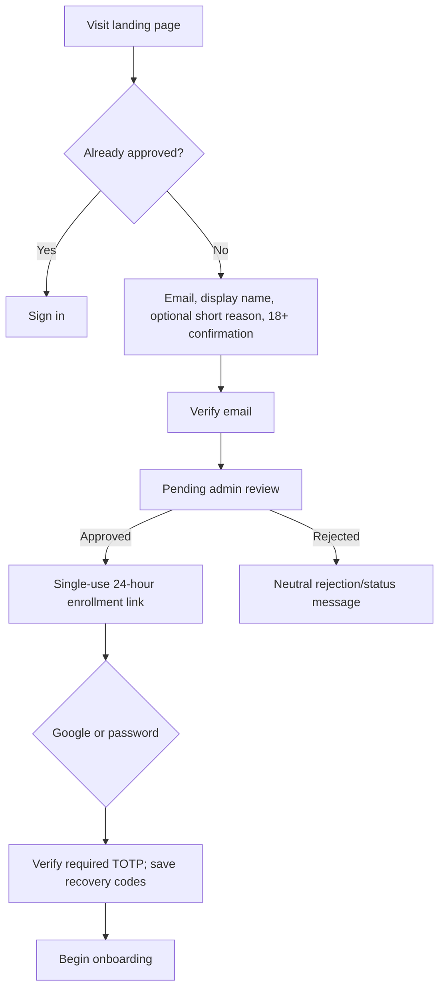

# UX Flows and Interaction Contract

**Status:** Authoritative interaction baseline\
**Audience:** Product, design, frontend, backend, curriculum, QA, and security\
**Related:** [PRD](PRD.md), [requirements matrix](requirements-matrix.md), [architecture](architecture.md)

## 1. Experience principles

1. **Teach before judging.** Practice explains mistakes immediately; exams deliberately restrict help.
2. **Literal explanation first, analogy second.** A hobby analogy is optional and must always reconnect to the exact technical model.
3. **Show why the next activity was chosen.** Adaptive movement is inspectable: prerequisite, weak evidence, due review, learner choice, or admin plan edit.
4. **No dead ends.** AI, runner, GitHub, or email failure yields a clear retry/fallback path and never discards saved work.
5. **Server truth is visible.** “Quick Run” is a preview; “Submit/Grade” is the authoritative runtime.
6. **Privacy is not hidden in settings.** Mentor visibility, cohort visibility, provider routing, inactivity copies, and exam-event logging are disclosed at the moment they matter.
7. **Mastery is evidence, not punishment.** A wrong answer produces remediation; it does not erase prior work.
8. **Admin actions remain admin actions.** Mentor view never silently becomes learner impersonation.
9. **Responsive, keyboard-first UI.** All core flows work on current desktop/laptop browsers and iOS Safari without requiring hover, even when hover enhancements exist.

## 2. Information architecture

### Public routes

- `/` — purpose, supported tracks, privacy/mentor disclosure, sign in, request access;
- `/request-access` — minimal request form and status lookup;
- `/auth/*` — redirect/callback/error routes owned by the identity integration;
- `/invite/:token` — one-time enrollment, password choice or Google link, MFA registration;
- `/privacy`, `/terms`, `/status`.

### Learner routes

- `/home` — continue, due reviews, streak, recent project, provider/runner notices;
- `/onboarding` — staged profile, goal, experience, interests, availability, language selection;
- `/roadmap/:enrollmentId` — visual concept graph plus accessible list view;
- `/learn/:learningSessionId` — lesson/activity shell;
- `/practice/:activityId` — quiz/debug/code practice;
- `/exam/:examSessionId` — restricted exam shell;
- `/chat` and `/chat/:threadId` — new/resume/archive threads;
- `/projects`, `/projects/:projectId`, `/reviews/:reviewId`;
- `/appeals`, `/appeals/:appealId`;
- `/cohort`, `/profile/:publicId`, `/achievements`;
- `/settings/profile`, `/settings/privacy`, `/settings/security`, `/settings/providers`, `/settings/notifications`, `/settings/data`.

### Admin routes

- `/admin` — actionable overview;
- `/admin/access-requests`, `/admin/learners/:id`;
- `/admin/plans/:learnerId`, `/admin/appeals`, `/admin/reviews`;
- `/admin/content`, `/admin/content/:version`, `/admin/publications`;
- `/admin/providers`, `/admin/costs`, `/admin/jobs`, `/admin/system`, `/admin/backups`, `/admin/audit`.

## 3. Global shell and state behavior

The authenticated shell contains:

- product/home link;
- current track/language and progress;
- **Continue learning** primary action;
- roadmap, reviews, chat, projects, cohort, and settings;
- notification center;
- connectivity/save indicator;
- learner/admin role switch only for a user who actually holds both roles.

Global async states use the same contract:

- **loading:** skeleton preserving layout;
- **empty:** explanation plus one meaningful action;
- **offline:** local drafts may continue where safe; grading, AI, and identity actions are disabled;
- **degraded:** named dependency and canonical fallback, e.g. “Tutor unavailable; lesson and grading still work”;
- **error:** safe message, correlation ID, retry, and “report problem”;
- **saving/saved/conflict:** explicit status for code, answers, plan edits, and long forms.

No destructive action relies on color alone. Toasts never contain the only copy of critical information.

## 4. Access request and enrollment (`AUTH-001`–`AUTH-003`)

### 4.1 Request access

Form rules:

- Do not collect legal name, date of birth, hobbies, provider keys, or password at request time.
- An email can have one open request. Repeated submissions return the same neutral state to reduce account enumeration.
- Status links are signed, expiring, and show no private cohort details.
- Approval email never contains a generated password. The link is one-time; expiry offers a new-link request.
- Google sign-in cannot bypass approval: an unapproved verified email returns to request status.

Acceptance evidence:

- E2E tests for pending/approved/rejected/expired/already-used links;
- account-enumeration response comparison;
- audit record for admin decision;
- proof that email templates contain no password.

### 4.2 Sign in, MFA, and one-device behavior (`AUTH-002`–`AUTH-005`)

Sign-in screen offers Google and email/password. Password recovery sends a one-time reset link. After either primary method, the learner completes required TOTP; a custom Better Auth hook ensures Google/social sign-in cannot bypass that challenge. Email OTP alone is not presented as the independent second factor. An optional passkey can later replace the password/Google step as a first factor only if the product still enforces its approved MFA policy.

When a new browser profile signs in and an active Better Auth database session exists:

1. Block the new browser family; never silently replace the active family.
2. If the learner still has the original browser, they log out there normally. If it is lost, `/lost-device` returns a neutral response, emails an eligible learner a 15-minute single-use mailbox proof, and creates the revocation request only after that proof is consumed. The proof is stored only as a hash and the link fragment is cleared from browser history. Mailbox control is not sufficient identity proof: the administrator separately confirms identity, records a reason, completes fresh MFA, and then approves or rejects.
3. After the original family is released, require the normal primary factor and TOTP on the new browser.
4. Notify the learner when the new browser family is approved, including bounded browser/time information and a security-review link.
5. Existing tabs in the same approved browser profile continue to share the one session. Any cached draft from a revoked family remains non-authoritative and cannot sync without reauthentication.

Settings show the current family, token-free recent security history, **Log out**, and the lost-device request state. The administrator can approve/reject a revocation request or directly revoke an active learner family only after fresh MFA and a recorded reason. The 30-day remembered session still requires recent MFA for provider keys, account/security changes, export/delete, recovery changes, and privileged administrator actions.

Recovery codes are shown once with download/print acknowledgement. Admin-assisted recovery is a separate audited flow; an admin cannot see a password, TOTP seed, passkey private key, or unused recovery code.

## 5. Onboarding and placement (`ONB-001`–`ONB-002`, `ADP-001`)

Onboarding is resumable and uses four short steps:

1. **Goal and context:** display name, IANA timezone, target outcome, available time, preferred session length.
2. **Experience:** new/intermediate/advanced self-assessment, prior languages, confidence by broad concept, “I’m not sure.”
3. **Interests and explanation:** optional hobbies/categories, analogy frequency (`on request`, `sometimes`, `often`), English/Hinglish preference if supported later. Explain that interests personalize teaching only and are not cohort-visible by default.
4. **Track:** C, C++, Java, or Python; DSA uses this implementation language. Show supported runtime/version once configured.

The learner reviews a concise privacy/mentor summary before continuing:

- the admin can inspect learning progress, attempts, code, and chats for mentoring/appeals according to policy;
- cohort visibility is separately opt-in;
- selected external AI providers receive bounded learning context/code when invoked;
- code is executed in a server sandbox;
- retention/export/delete controls are linked.

Placement offers **Start from the beginning** and **Check what I already know**. A diagnostic begins with shared foundations, adapts item difficulty, permits “I don’t know,” and may include bounded code tasks. Self-report influences starting difficulty but cannot mark a concept mastered. Before completion, show the proposed roadmap placement and allow the learner to challenge it or choose a review lesson.

## 6. Home and roadmap (`CUR-001`–`CUR-003`, `ADP-002`–`ADP-004`)

### Home priority order

1. In-progress exam or learning session requiring resume;
2. due spaced review;
3. current roadmap concept;
4. mentor-assigned remediation;
5. active project;
6. optional exploration.

Each recommendation includes a one-line reason such as “Review due after 7 days,” “Arrays are required before linked lists,” or “Your last two loop attempts confused the stopping condition.” The learner can choose another eligible activity; locked concepts explain prerequisites rather than merely disabling clicks.

### Roadmap modes

- Visual graph for pointer/large-screen use.
- Semantically equivalent outline/list for keyboard, screen reader, mobile, and reduced-motion use.
- Filters: `current`, `available`, `mastered`, `review due`, `all`.
- Concept detail is accessible by focus/click, not hover only. It shows objective, prerequisites, status, evidence summary, estimated learning units, language, last/next review, and actions.

Status vocabulary is consistent:

- `Not started`;
- `Diagnostic suggested`;
- `Learning`;
- `Practice needed`;
- `Passed` (80–94 default);
- `Mastered` (95+ and critical evidence default);
- `Review due`;
- `Admin override`, always visibly attributed.

## 7. Learning-session lifecycle (`SES-001`–`SES-003`)

Learning sessions are distinct from login sessions and chat threads.

### Start/resume/new

- **Continue** resumes the most recent active learning session at its last server-confirmed activity/draft.
- **Start a focused session** asks duration/goal and creates a new session against the same durable plan/mastery state.
- **End session** records reflection and returns unfinished work to resumable state; it does not reset progress.
- After approximately 30 minutes without meaningful activity, mark the session inactive but resumable. Do not silently submit ordinary practice.

If the same session is opened in two tabs, optimistic version checks prevent silent overwrite. The later save receives a comparison dialog: keep server version, keep this version as a new revision, or copy differences.

### Lesson shell (`LES-001`–`LES-003`)

The lesson shell contains:

- objective and prerequisite reminder;
- short literal explanation;
- optional analogy card clearly labelled as an analogy;
- runnable worked example with line-by-line/step visualization where supported;
- one- or two-question micro-check;
- guided practice;
- coding/debugging task;
- recap and next reason.

Actions: **Explain more simply**, **Use my interests**, **Give another example**, **Show first hint**, **Ask tutor**, **I already know this**, and **Report content issue**. “I already know this” triggers evidence or an assessment; it does not mark completion.

Hints form a ladder and reveal progressively. They do not reveal the final answer before an attempt unless the learner explicitly chooses **Show solution and mark for remediation**, which records non-mastery and schedules a related task.

## 8. Practice code and visualizers (`RUN-001`–`RUN-004`)

The code workspace includes:

- exercise statement, constraints, examples, and supported runtime;
- editor, file tabs if allowed, input panel, visible tests;
- output/compile panel treated as plain text;
- visualizer for supported concepts;
- save state and quota indicator;
- **Quick Run** only where a client runtime exists;
- **Run on Server** for visible/custom input;
- **Submit/Grade** for authoritative visible and hidden tests.

### Result labels

- Quick Run: “Browser preview — does not affect progress.”
- Run on Server: “Official runtime, practice input — not a final grade.”
- Submit/Grade: “Official graded submission.”

The result view distinguishes queued, compiling, running, accepted, wrong answer, compile error, runtime error, timeout, memory/output limit, infrastructure failure, and cancelled. Infrastructure failure never counts as a learner attempt. Hidden-test feedback names the failed requirement/category without disclosing secret input or expected output.

If the queue is busy, show position/estimate and allow navigation away; notify on completion. Repeated clicks reuse an idempotency key and do not create duplicate authoritative submissions.

## 9. Assessment and exam (`ASM-001`–`ASM-003`, `EXM-001`–`EXM-004`)

### Practice assessment

Each response receives correctness, why, misconception-aware explanation, and a next action. The learner can dispute an item immediately. Correctness that depends on exact code output uses the runner, never the LLM alone.

### Exam preflight

Before starting, disclose and confirm:

- duration, number/type of items, passing and mastery thresholds;
- allowed compile/run behavior and that tutor/hints/docs/web/visualizer are disabled;
- server timer and autosave behavior;
- event types logged (navigation, saves, compile/run, submit, focus/fullscreen, paste size, reconnect, server errors);
- focus/paste signals require human review and are not automatic guilt;
- disconnect policy and appeal path.

Run a connectivity/autosave check. The server starts the immutable exam form only after confirmation.

### Exam behavior

- Sticky server-synchronized timer with accessible announcements at material thresholds, not every second.
- Question navigator indicates answered/flagged/unsaved, not correctness.
- Raw compiler errors may be shown if the approved exam policy allows compile/run; hidden-test feedback appears only after submission.
- Autosave at most every ten seconds and on navigation, with last server-confirmed time.
- On disconnect, the server timer continues; local drafts queue. Reconnect merges only when the question revision matches.
- At expiry, the last server-confirmed save is submitted. A material infrastructure outage permits an admin-issued equivalent re-exam, not retroactive timer pausing.

Default outcome language:

- below 80 or below a critical-cluster floor: **Not passed — remediation assigned**;
- 80–94: **Passed — next topic unlocked; mastery practice available**;
- 95+ and all critical criteria: **Mastered**.

Retakes use a new equivalent form after failed-cluster remediation and configured cooldown. Results show criterion evidence, not hidden answers.

## 10. Tutor chat and learner memory (`AI-001`–`AI-005`, `SES-002`–`SES-003`)

Chat landing separates:

- **Continue recent thread**;
- **New thread**;
- **Ask about current concept**;
- **Ask about project**;
- archived/searchable threads.

A new thread receives the relevant structured learner context and approved summaries; it does not copy all old messages into the visible conversation. The context drawer explains what the tutor is using: current concept, language, mastery evidence, selected interests, recent errors, and project/lesson version. Learners can exclude optional profile interests for a thread.

Launch context policy `tutor-context-v2` uses the owner/current-skill mastery facet, active tags derived from at most 40 valid deterministic evidence rows, goals/preferences, the latest stored weekly summary when present, and—only for a selected active owned thread—a tail of at most six messages/4,800 total characters. Stored strings remain untrusted user-role JSON; no prior assistant message becomes a model instruction. The UI shows the exact content-free category/provenance/cap manifest. See [Codestead mentor context policy](tutor-context.md).

Provider status appears unobtrusively: selected provider/model family, whether the learner or admin fallback key is being used, and a link to data-routing settings. Never show a key. If routing changes mid-request, record and disclose the provider used for that answer.

Sending creates one client UUID. If the browser loses the transport response, it retries once with that exact UUID and payload. The server's owner/action-scoped durable receipt returns the original safe answer and provenance without another provider call or duplicate chat/model-call rows. A UUID reused for changed input returns a clear 409 conflict rather than guessing which request the learner intended.

Tutor responses distinguish:

- authored/cited curriculum facts;
- generated analogy or explanation;
- deterministic runner result;
- model opinion/code-quality suggestion.

Actions include **Helpful**, **Incorrect**, **Unsafe**, **Too advanced**, **Explain differently**, and **Appeal correctness**. Reporting preserves the exact model/prompt/content versions for admin review. The tutor cannot change an official grade through chat.

Provider failure states:

- retry same provider when safe;
- offer another consented learner provider;
- disclose use and cost policy before admin fallback;
- show canonical authored explanation when no provider succeeds.

## 11. BYOK settings (`AI-002`–`AI-003`)

Provider settings show each credential as provider, label, fingerprint/last four, validation status, last used, task permissions, budget, and priority. Flow:

1. Select provider and read a provider-specific “create a project key with a spending cap” guide.
2. Paste the key into a password field.
3. Confirm which content categories may be sent: lesson context, chat, code excerpt, project excerpt.
4. Server validates, envelope-encrypts, and bounds plaintext to that request.
5. Learner and ordinary administrator UI display only status/fingerprint. A dedicated administrator reveal requires fresh MFA, a reason, immutable audit, a no-store response, and learner notification every time.

Available actions are **Test**, **Change**, **Disable**, and **Delete**, all requiring recent MFA. Administrator test/replacement creates a UUID and reuses it only for an indeterminate transport retry; the server durably replays the safe result and never repeats provider validation, credential mutation, audit, or notification rows for an exact retry. A changed payload under the same UUID receives 409. Administrator reveal is deliberately separate and non-replayable: it accepts no idempotency UUID, is reasoned/audited each time, is short-lived in the UI, and is never persisted in browser storage. If an admin fallback is available, learners separately opt in and see its quota behavior.

## 12. Projects and GitHub review (`PRJ-001`–`PRJ-003`)

Project creation supports an empty workspace, approved starter, upload, or repository link. Show the 2 GB durable quota and what counts.

Public GitHub flow:

1. Validate URL and display owner/repository/default branch.
2. Learner selects branch/commit and confirms they may submit the code.
3. System records immutable commit SHA.
4. Static analysis runs in isolation.
5. Optional AI review receives bounded excerpts/findings, not repository credentials or hidden files.
6. Results group correctness, maintainability, tests, security, and learning objectives with file/line links.

Private repository flow, if enabled, uses a GitHub App install for selected repositories with read-only permissions. The UI never asks for a reusable personal access token. Before any build/test, show the approved commands, dependency/network policy, expected resource limit, and that repository code is untrusted. Git hooks and GitHub Actions do not run.

## 13. Appeals (`RUN-007`, `DAT-007`)

Any official code result, exam item, AI correctness claim, project review finding, or admin plan decision exposes **Appeal/Ask for review** where applicable.

Appeal form preloads immutable evidence metadata and asks for a concise reason plus optional supporting text. Learners cannot modify the original artifact. Statuses are `submitted`, `triaged`, `needs learner input`, `under review`, `upheld`, `overturned`, `superseded`, and `closed`.

Admin review shows:

- learner claim;
- original source/answer and output;
- exercise/item/content/test/runtime or commit versions;
- model/provider/prompt versions if involved;
- deterministic re-run option using the original image when retained;
- prior admin actions and conflict-of-interest warning.

The decision requires rationale. An overturned grade appends corrective evidence and recalculates mastery; it does not mutate historical rows. Notify the learner in-app and by email without sensitive details.

## 14. Cohort profile and gamification (`SOC-001`–`SOC-002`)

Privacy settings independently control:

- profile discoverability;
- alias/display name;
- avatar;
- selected mastery badges;
- streak visibility;
- selected projects;
- leaderboard participation.

Defaults are alias-only and not on the leaderboard. The preview shows exactly what another learner sees. Email, timezone, precise activity, attempts, failures, raw code, chat, provider use, and admin notes are never available to the cohort.

Leaderboard periods and score explanations are visible. Prefer mastery breadth, consistent review, and project milestones; do not reward number of submissions, hours online, rapid completion, or AI/token spending. Learners can leave without losing private achievements.

## 15. Inactivity and other notifications (`NOT-001`–`NOT-002`)

Inactivity begins 24 hours after the last authoritative meaningful learning event; login, page views, heartbeat, and ordinary chat do not reset it. At 24 hours queue one generic learner reminder and one separate generic administrator notice outside the learner's quiet hours. At 72 hours queue one final learner reminder, then remain silent for that episode. Meaningful learning closes the episode; a future 24-hour period may create a new one.

Settings include timezone and quiet hours and explain that this cohort sends one generic learner reminder and one generic mentor notice to the admin. The policy is disclosed and acknowledged during enrollment; it is not hidden as a marketing toggle. Admin may temporarily pause reminders for a learner with a reason/audit. Email contains a generic return link, not score, error, code, chat, provider, or project details. Notification controls never disable security, appeal, data-export, or backup-administration notices.

## 16. Admin experience (`ADM-001`–`ADM-005`)

### Learner overview

Show current plan, mastery/evidence, due reviews, repeated misconceptions, sessions, attempts, projects, appeals, quota, and high-level provider health/cost. Raw chat/code access is a deliberate click with purpose context and audit; it is not expanded by default.

### Plan editing

Admin proposes add/remove/reorder/unlock/remediation actions with reason and effective date. A diff previews prerequisites and downstream effects. Saving creates a new plan revision attributed to the admin and notifies the learner. Historical evidence is unchanged.

### Mentor view

**View learner experience** opens a read-only rendering with a permanent “Mentor preview” banner. It does not mint a learner session or spend learner keys. If privileged view-as is ever enabled, it follows the architecture's break-glass controls and is not initiated by an ordinary profile click.

### Content publication

Admin works through draft, review, automated verification, coverage audit, preview, approval, scheduled/immediate publish, and rollback. Verification failures link to exact lesson/example/test/language. Published versions are immutable; fixes create a new version.

### Operations

Dashboards surface provider health/cost, runner queue, email outbox, storage quota, backup age/restore points, content verification, security events, and pending appeals. “Healthy” must be evidence-based; unknown is not green.

## 17. Data controls (`DAT-001`–`DAT-004`)

Settings show category-level retention and allow:

- export request with recent MFA;
- account deletion request and cooling-off/confirmation policy;
- delete/archive individual chat threads where policy permits;
- remove provider credentials and GitHub links immediately;
- clear browser cache independently from server data;
- see quota usage by category.

Export is assembled asynchronously, encrypted or protected by a short-lived one-time link, and expires. It never contains hidden tests, other users, plaintext secrets, internal security rules, or backup material. Deletion reports what is deleted immediately, what remains temporarily in backups, and the expiry window.

## 18. Accessibility and responsive acceptance (`NFR-A11Y-*`)

- All core actions work at 320 CSS px width and 200% zoom without horizontal page scrolling, except the code editor may use an internal scroll region.
- Full keyboard operation, visible focus, skip links, semantic headings/landmarks, accessible names, and no hover-only information.
- Roadmap graph has equivalent structured list; visualizer has text/step representation.
- Editor supports tab-key escape instructions and accessible output/status announcements.
- Do not announce streaming tokens individually; announce completed paragraphs/status.
- Respect reduced motion and contrast preferences; time limits expose documented accommodations through admin policy.
- Error messages identify fields and resolution; color is never the sole indicator.
- Manual screen-reader and keyboard checks complement automated testing.

## 19. UX acceptance evidence

| Flow | Required evidence |
|---|---|
| Access/enrollment | E2E approval/link-expiry/Google/password/MFA/recovery suite; email snapshot review |
| Session security | new-device revocation, self/admin revocation, recent-MFA, offline-draft reauth tests |
| Onboarding/placement | resumability, “I don't know,” beginner and advanced diagnostic scenarios |
| Roadmap | graph/list parity, prerequisite reason, admin-override attribution |
| Lesson/adaptation | golden learner journeys for correct, misconception, repeated failure, mastery, review due |
| Code | quick/server/grade label tests; queue, timeout, hidden-test, infrastructure-failure states |
| Exam | timer/autosave/reconnect/expiry/event disclosure/equivalent-retake scenarios |
| AI/chat | consent-aware routing, canonical fallback, context drawer, incorrect-response appeal |
| BYOK | add/test/change/delete, no-reveal, recent-MFA and redacted telemetry tests |
| GitHub | public SHA flow, private GitHub App permissions, malicious-repo safe state |
| Social | field-level visibility matrix, opt-in/opt-out and alias behavior |
| Admin | read-only mentor view, plan diff/revision, audited raw-detail access |
| Notifications | timezone/quiet hours, once-per-episode per recipient, disclosure/pause, bounce, and no-sensitive-email review |
| Data | quota, export, deletion, browser-cache distinction and backup-expiry copy review |
| Accessibility | automated scans plus keyboard, zoom, iOS Safari, and screen-reader manual report |

## 20. UX decisions still required

1. Whether NIM is always first, merely required as an available adapter, or mandatory for every AI response.
2. Exact MFA methods allowed and the evidence required for admin-assisted recovery.
3. The exact quiet-hour defaults and whether a learner may request an admin-approved temporary reminder pause.
4. Whether browser Python Quick Run ships initially.
5. Whether private GitHub repositories and approved build/test execution ship initially.
6. Exact leaderboard formula and default participation (secure baseline: off).
7. Exam compile/run visibility, 80–94 unlock policy, retake cooldowns, and material-disconnect threshold.
